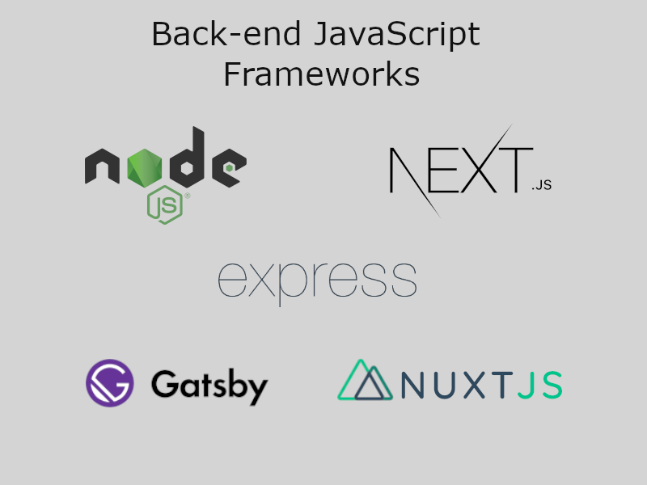
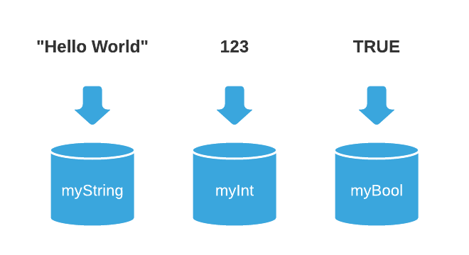

[`Programación con JavaScript`](../Readme.md) > `Sesión 01`

---

# Sesión 1: Fundamentos de JS

## Objetivos

Analizar la trayectoria de JavaScript, evaluar por qué es una buena opción aprenderlo y usar sus fundamentos.

---

## Tabla de Contenidos

- **[¿Por qué JavaScript?](#por-qué-javascript)**

- **[¿Qué es JavaScript?](#qué-es-javascript)**

- **[¿Qué son las variables?](#qué-son-las-variables)**

- **[`let` y `const`](#let-y-const)**

- **[Tipos de Datos](#tipos-de-datos)**

- **[Operador typeof](#operador-typeof)**

  - [Ejemplo 1: Tipos de datos y operador `typeof`](./Ejemplo-01)

- **[Type coercion](#type-coercion)**

- **[Operadores](#operadores-básicos)**

  - [Ejemplo 2: Operadores](./Ejemplo-02)

- **[Precedencia de operadores](#precedencia-de-operadores)**

  - [Ejemplo 3: Precedencia de operadores](./Ejemplo-03)

  - [Reto 1: Precedencia de operadores](./Reto-01)

---

## ¿Por qué JavaScript?

### Una de las tecnologías más populares

Por octavo año consecutivo, JavaScript se ha mantenido como el lenguaje de programación más usado entre desarrolladores.
Esto de acuerdo a la encuesta realizada por [Stack Overflow](https://stackoverflow.com/) el 2020 a casi 65.000
desarrolladores en todo el mundo.

> [Aquí puedes consultar la investigación completa](https://insights.stackoverflow.com/survey/2020).


### JavaScript en el Front

Frontend es la parte de un programa, dispositivo o aplicación a la que el usuario final puede acceder directamente. Son
todas las tecnologías de diseño y desarrollo web que corren en el navegador y que se encargan de la interactividad con
los usuarios.


### JavaScript en el Back

Backend por el contrario, es la capa de acceso a datos de un software a la cual los usuarios no tienen acceso
directamente. Aquí se encuentran los servidores y bases de datos, esta parte se encarga de enviar los datos hacia el
Front conforme el usuario los requiera.



### Grandes compañías usando JavaScript

JavaScript se encuentra en todos lados, siendo el lenguaje que predomina en la web. Es usado por grandes compañías
tecnológicas, algunas hacen fuerte uso de Node como Netflix o Uber, otras son responsables de partes muy importantes del
ecosistema de JavaScript como Google que se encarga de mantener Angular, o Facebook que está detrás de React.


---

## ¿Qué es Javascript?

JavaScript es:

- Un lenguaje de programación que permite ejecutarse principalmente en cada navegador (Google Chrome, Safari, Firefox,
  Opera, etc.).
- Multiplataforma. También puede ser usado fuera del navegador.
- Multiparadigma. Si bien se define como un lenguaje orientado a objetos es lo suficientemente flexible como para
  implementar principios de programación funcional e incluso programación reactiva.
- **Javascript no es Java. Son lenguajes completamente diferentes**
- Uno de los tres pilares de un sitio web:
    - HTML maneja el contenido, la estructura, el esqueleto, el "markup".
    - CSS maneja la presentación, el diseño, la visualización de la aplicación.
    - JS maneja la interactividad, efectos, dinamismo y más adelante, la gestión de datos y el flujo de los mismos a
      otras áreas de la aplicación.


---

## ¿Qué son las variables?

Las variables se utilizan para almacenar información dentro de tu programa para ser manipulados.

En el modo más general, te ayudan a **etiquetar datos**. Los llamaremos en el momento que los necesitemos a lo largo del
programa.



Las variables se dividen en 4 partes:

```javascript
var name = "John Doe";
```

- **Declaración (`var`)**. Cuando comienzas una variable, debes de utilizar la palabra `var`
- **Nombre (etiqueta)**. Irá del lado izquierdo. Será cómo llamarás la variable más adelante.
- **Asignación (`=`)**. A diferencia de la aritmética donde se le conoce como "igual", en Javascript se le conoce como
  asignación, el cual asignará el valor de lo que el área de su lado derecho genere hacia el lado izquierdo (Nombre).
- **Valor (Tipo de dato)**. Puede ser un texto, un número, un conjunto de datos (objetos, arreglos).

Ahora bien, nombrar tus variables implica que deberán ser lo más descriptivas posibles.

Es decir, que si otras personas leyeran tu código, entenderían rápidamente que significa cada dato porque el nombre de
su variable lo explica todo.

```javascript
var name = "John Doe";
var country = "Mexico";
var age = 35;
```

Si tú lees el nombre de las variables anteriores, rápidamente comprendes de qué tratan.

Si generas una variable que implica dos palabras, te recomendamos usar una técnica llamada **"Camel Case"**.

```javascript
var firstName = "John";
var lastName = "Doe";
var fullName = "John Doe";
```

**"Camel Case"** implica:

- Conectar ambas palabras sin espacio, volviéndola una.
- La palabra comenzará con minúscula.
- La segunda palabra empezará con mayúscula.

---

## `let` y `const`

En JavaScript todas las variables son inicializadas con `undefined` al momento de su creación.

```javascript
console.log(name); // undefined

var name = "John Doe";
```

Esta es otra diferencia entre `let` y `var`. Si se trata de acceder a una variable con `let` antes de ser declarada
obtenemos un `ReferenceError` en lugar de `undefined`.

```javascript
console.log(name); // ReferenceError: name is not defined

let name = "John Doe";
```

`const` es muy similar a `let`, la única diferencia es que una vez asignado un valor a una variable ya no se puede
reasignar.

```javascript
let name = 'John Doe';
const email = 'john@doe.com';

name = 'Jane Doe';
email = 'jane@doe.com'; // TypeError: Assignment to constant variable.
```

Algo muy importante es que declarar una variable con `const` no significa que esta sea inmutable, simplemente no se
puede reasignar.

```javascript
const person = {
  name: 'John Doe'
};

person.name = 'Jane Doe';

person = {}; // TypeError: Assignment to constant variable.
```

Declarar un objeto con `const` no significa que no podamos cambiar sus propiedades, lo que no podemos hacer es asignarle
un nuevo valor.

Como regla general puedes usar `const` por defecto y usar `let` solo cuando sea necesario, esto evita la fatiga mental
de pensar cuándo usar una opción o la otra.

---

## Tipos de Datos

Todos los lenguajes de programación cuentan con estructuras de datos las cuales varían de un lenguaje a otro. JavaScript
es un lenguaje de tipado débil, significa que no es necesario declarar el tipo de variable antes de usarla. El tipo de
dato es determinado automáticamente cuando el programa esté siendo procesado.

JavaScript cuenta con seis tipos de datos que pueden ser divididos en tres categorías:

#### Primitivos

- String
- Number
- Boolean

#### Compuestos (Referencia)

- Object
- Array
- Function

#### Especiales

- Undefined
- Null

### String

Este tipo de dato es utilizado para almacenar cadenas de texto. Los strings son creados con comillas dobles o sencillas
alrededor de uno o más caracteres.

```javascript
var a = 'Hello World!';	// Comillas sencillas
var b = "Hello World!";	// Comillas dobles
```

Las comillas también pueden formar parte de la cadena de texto siempre y cuando no coincidan con las comillas que abren
y cierran el string.

```javascript
var a = "Let's learn JavaScript.";	// Comilla sencilla dentro de comillas dobles
var b = 'He said "Hello" and left.';	// Comillas dobles dentro de comillas sencillas
var c = 'We\'ll never stop learning.';	// Escapando comilla sencilla con backslash
```

Si queremos agregar el valor de una variable a una cadena de texto debemos concatenar ambos con el signo `+` y siempre
tener cuidado de agregar espacios en blanco para que no salgan ambos textos juntos.

```javascript
const name = 'John Doe';

console.log("Welcome " + name); // Welcome John Doe
```

Una alternativa a esta concatenación es el uso de _template strings_ que son cadenas de texto que permiten la
interpolación mediante expresiones. La sintaxis consta de dos partes, la primera es delimitar la cadena de texto con el
uso de backticks. La segunda parte es usar el signo de dólar y llaves para indicar un placeholder o expresión a evaluar.

```javascript
const name = 'John Doe';

console.log(`Welcome ${ name }`); // Welcome John Doe
```

Estas plantillas hacen más fácil crear cadenas de string con múltiples líneas.

```javascript
const message = `Welcome Back!
John Doe
`;

console.log( message ); 
// Welcome Back!
// John Doe
```

Además de variables también podemos usar expresiones matemáticas.

```javascript
const a = 10;
const b = 20;

console.log(`a + b = ${a + b}`); // a + b = 30 
```

### Number

El tipo de dato Number se usa para representar números enteros positivos o negativos con o sin punto decimal, incluso se
puede usar en números con notación científica.

```javascript
var a = 12;	// Entero
var b = 32.43;	// Decimal
var c = 2.25e+6;  // Equivalente a 2.25x10^6 o 2250000
var d = 2.25e-6;  // Equivalente a 2.25x10-6 o 0.00000225
```

Este tipo de dato incluye algunos valores especiales: `Infinity`, `-Infinity` y `NaN`.

`Infinity` representa el infinito matemático `∞`, el cual es mayor a cualquier otro número. Se obtiene al dividir un
número mayor o menor a cero entre cero.

```javascript
console.log(7 / 0); // Infinity
console.log(-7 / 0);  // -Infinity
```

Por otro lado, `NaN` representa un valor no numérico. Es el resultado de una operación matemática inválida.

```javascript
console.log("Hello World" / 2);	// NaN
console.log("Hello World" * 2);	// NaN
console.log(Math.sqrt(-1)); // NaN
```

### Boolean

Las variables que contengan este tipo de dato sólo pueden almacenar uno de dos valores: `true` o `false`. Normalmente se
usan para representar estados que signifiquen sí (`true`) o no (`false`), encendido (`true`) o apagado (`false`), etc.

```javascript
var isUserActive = true;  // Sí, el usuario se encuentra activo
var isUserAdmin = false;  // No, el usuario no es admin
```

### Undefined

Cuando una variable es declarada, pero no se le ha asignado un valor, por default su valor es `undefined`.

```javascript
var a;
var b = 'Hello World';

console.log(a);	// undefined
console.log(b);	// Hello World
```

### Null

Este es otro tipo de dato especial con un único valor posible: `null`. Cuando encontremos `null` significa que no hay
valor. No es lo mismo que cero o `undefined`, simplemente es `null` o nada.

Se puede vaciar una variable de manera explícita asignando el valor `null`.

```javascript
var a = 'Hello World';
console.log(a);	// Hello World

a = null
console.log(a);	// null
```

---

## Operador `typeof`

El operador `typeof` es utilizado para averiguar qué tipo de dato contiene una variable. Puede ser usado con o sin
paréntesis (`typeof(a)` o `typeof a`).

#### [Ejemplo 1: Tipos de datos y operador `typeof`](./Ejemplo-01)

---

## Type coercion

La coerción de datos o type coercion es el proceso de convertir un valor de un tipo de dato a otro, por ejemplo, string
a number, boolean a string, etc. Dicho proceso se puede dar de manera tanto explícita como implícita.

La forma explícita es cuando se quiere hacer de manera intencional usando las funciones adecuadas como `String(value)`
o `Number(value)`, a esto también se le conoce como type casting.

Anteriormente mencionamos que JavaScript es un lenguaje de tipado débil, es por ello que los valores pueden cambiar de
tipo de dato de manera automática, esto es la coerción de datos implícita. Usualmente pasa cuando aplicamos algún
operador a valores con tipos de datos distintos.

En JavaScript solo existen tres tipos de conversiones posibles:

- String
- Number
- Boolean

### String conversion

Para convertir un valor a string de manera explícita usamos la función `String()`. La coercion implícita se da cuando
usamos el operador `+` y cualquiera de los operandos es un string.

```javascript
String(123);  // Explícito
123 + ''; // Implícito
`${123}`; // Implícito
```

Todos los valores primitivos se pueden convertir en strings.

```javascript
String(123);  // '123'
String(3.14); // '3.14'
String(true); // 'true'
String(false);  // 'false'
String(undefined);  // 'undefined'
String(null); // 'null'
```

### Numeric conversion

Para convertir explícitamente un valor a tipo numérico se aplica la función `Number()`. La coerción implícita es un poco
más compleja que la de strings porque se da en distintas formas, como el uso de operadores aritméticos, toma en cuenta
que para el caso del operador `+` es string conversion y no numérico si uno de los operandos es string, como ya se
mencionó anteriormente.

```javascript
Number('123');  // Explícito
+ '123';  // Implícito
1 - '1';  // Implícito
2 * '2';  // Implícito
```

Los valores primitivos también pueden ser convertidos a tipos numéricos con distintos resultados.

```javascript
Number(' 10 '); // 12
Number('-10');  // 10
Number('123abc'); // NaN
Number(true); // 1
Number(false);  // 0
Number(null); // 0
Number(undefined);  // NaN
```

### Boolean conversion

Al igual que con strings y números, para una conversión explícita se usa una función, en este caso es `Boolean()`. La
coerción implícita se da en un contexto lógico o al usar operadores lógicos.

```javascript
Boolean(1); // Explícito
if(1) { ... } // Implícito - Contexto lógico
!!2;  // Implícito - Operador lógico
2 || 'Hello World'; // Implícito - Operador lógico
```

> En la siguiente sesión se verá más a detalle los operadores lógicos y booleanos

---

## Operadores Básicos

Con respecto al tipo de datos `Number` puedes ejecutar operaciones para cambiar su valor.

| Operador | Descripción                       | Ejemplo Javascript    | Observaciones                                     |
|----------|-----------------------------------|-----------------------|---------------------------------------------------|
| +        | Adición                           | var resultado = 4 + 3 |                                                   |
| -        | Substracción                      | var resultado = 4 - 3 |                                                   |
| *        | Multiplicación                    | var resultado = 4 * 3 |                                                   |
| /        | División                          | var resultado = 4 / 2  | "resultado" devolvería 2                                              |
| %        | "Modulus"<br>Residuo de la división | var resultado = 4 % 2 | "resultado" devolvería 0                          |
| ++       | Incremento                        | var resultado = 4++   | "resultado" devolvería 5, <br> después de su ejecución |
| --       | Decremento                        | var resultado = 4--   | "resultado" devolvería 3, <br> después de su ejecución |

#### [Ejemplo 2: Operadores](./Ejemplo-02)

---

## Precedencia de Operadores

La precedencia es el orden en el cual los operadores se evaluan al momento de ejecutar la operación.

<table>
  <tr>
    <th>Precedencia</th>
    <th>Operador</th>
    <th>Descripción</th>
    <th>Asociatividad</th>
  </tr>
  <tr>
    <td>Primero</td>
    <td>(...)</td>
    <td>Agrupación</td>
    <td>n/a</td>
  </tr>
  <tr>
    <td rowspan="2">Segundo</td>
    <td>++</td>
    <td>Incremento</td>
    <td>n/a</td>
  </tr>
  <tr>
    <td>--</td>
    <td>Decremento</td>
    <td>n/a</td>
  </tr>
  <tr>
    <td class="tg-0lax" rowspan="2">Tercero</td>
    <td class="tg-0lax">+</td>
    <td class="tg-0lax">Unario más</td>
    <td class="tg-0lax" rowspan="2">Deracha a izquierda</td>
  </tr>
  <tr>
    <td class="tg-0lax">-</td>
    <td class="tg-0lax">Negación unaria</td>
  </tr>
  <tr>
    <td rowspan="3">Cuarto</td>
    <td>\*</td>
    <td>Multiplicación</td>
    <td rowspan="3">Izquierda a derecha</td>
  </tr>
  <tr>
    <td>/</td>
    <td>División</td>
  </tr>
  <tr>
    <td>%</td>
    <td>Módulo</td>
  </tr>
  <tr>
    <td rowspan="2">Quinto</td>
    <td>+</td>
    <td>Adición</td>
    <td rowspan="2">Izquierda a derecha</td>
  </tr>
  <tr>
    <td>-</td>
    <td>Substracción</td>
  </tr>
</table>

#### [Ejemplo 3: Precedencia de operadores](./Ejemplo-03)

#### [Reto 1: Precedencia de operadores](./Reto-01)
