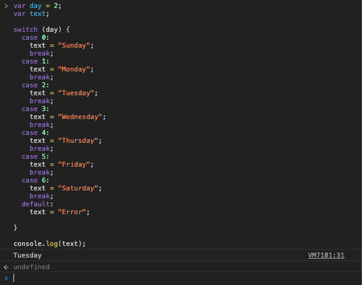

[`Programación con JavaScript`](../../Readme.md) > [`Sesión 02`](../Readme.md) > `Ejemplo 02`

---

## Ejemplo 2: Usando `switch`

### Objetivo

Analizar la sintaxis de `switch` y determinar en qué casos es mejor usarlo en lugar de `if`/`else`.

#### Requisitos

En una nueva carpeta vamos a crear un archivo `HTML` en blanco llamado `index.html`:

```html
<html>
  <head>
    <script type="text/javascript" src="./ejemplos-sesion-2.js"></script>
  </head>
</html>
```

Dentro de la misma carpeta creamos un archivo `ejemplos-sesion-2.js` que es donde se trabajarán los ejemplos de esta sesión. Finalmente abre el archivo `index.html` en Chrome e inspecciona la consola para ver los resultados.


#### Desarrollo

Vamos a calcular el día de la semana dependiendode su valor númerico empezando en cero.

```javascript
var day = 2;
var text;

switch (day) {
  case 0:
    text = "Sunday";
    break;
  case 1:
    text = "Monday";
    break;
  case 2:
    text = "Tuesday";
    break;
  case 3:
    text = "Wednesday";
    break;
  case 4:
    text = "Thursday";
    break;
  case 5:
    text = "Friday";
    break;
  case 6:
    text = "Saturday";
    break;
  default:
    text = "Error";

}

console.log(text); // Tuesday
```


