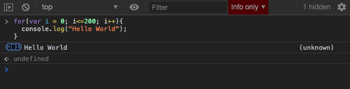

[`Programación con JavaScript`](../../Readme.md) > [`Sesión 02`](../Readme.md) > `Ejemplo 03`

---

## Ejemplo 2: Ciclo `for`

### Objetivo

Analizar el funcionamiento de los ciclos o bucles para ejecutar código que queremos repetir `n` cantidad de veces.

#### Requisitos

En una nueva carpeta vamos a crear un archivo `HTML` en blanco llamado `index.html`:

```html
<html>
  <head>
    <script type="text/javascript" src="./ejemplos-sesion-2.js"></script>
  </head>
</html>
```

Dentro de la misma carpeta creamos un archivo `ejemplos-sesion-2.js` que es donde se trabajarán los ejemplos de esta sesión. Finalmente abre el archivo `index.html` en Chrome e inspecciona la consola para ver los resultados.


#### Desarrollo

Pensemos que queremos repetir un texto 5 veces y que aparezca en consola:


```javascript
console.log("Hello World");
console.log("Hello World");
console.log("Hello World");
console.log("Hello World");
console.log("Hello World");
```

Excelente, funcionará y se reflejarán en la consola.

Ahora bien, si te dijera que queremos repetirlo 200 veces, entonces copiar y pegar cada línea se volvería ineficiente (aparte de odiar al que te dio la instrucción).

¿Qué podemos hacer?

```javascript
for(var i = 0; i<=200; i++){
  console.log("Hello World");
}
```

Con esto, obtendremos de retorno los 200 `"Hello World"`.


