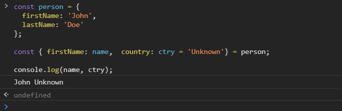

[`Programación con JavaScript`](../../Readme.md) > [`Sesión 03`](../Readme.md) > `Ejemplo 02`

---

## Ejemplo 3: Object Destructuring

### Objetivo

Extraer propiedades de un objeto mediante asignación por destructuring.

#### Requisitos

En una nueva carpeta vamos a crear un archivo `HTML` en blanco llamado `index.html`:

```html
<html>
  <head>
    <script type="text/javascript" src="./ejemplos-sesion-3.js"></script>
  </head>
</html>
```

Dentro de la misma carpeta creamos un archivo `ejemplos-sesion-4.js` que es donde se trabajarán los ejemplos de esta
sesión. Finalmente abre el archivo `index.html` en Chrome e inspecciona la consola para ver los resultados.

#### Desarrollo

Si la propiedad que queremos extraer no existe en el objeto se retorna `undefined`. Podemos usar asignar un valor por
default en caso de no encontrar la propiedad que buscamos. Para esto debemos asignar (`=`) un valor dentro de las llaves.

```javascript
const person = {
  firstName: 'John',
  lastName: 'Doe'
};

const { firstName, country = 'Unknown' } = person;

console.log(firstName, country); // John Unknown
```

En ocasiones no queremos usar el mismo nombre de la propiedad del objeto, por ejemplo cuando estamos consumiendo
información de un recurso externo o de una base de datos. Usando `:` podemos renombrar una variable.

```javascript
const person = {
  firstName: 'John',
  lastName: 'Doe'
};

const { firstName: name } = person;

console.log(name); // John 
```

La asignación de un valor default y el cambio de nombre de la variable se pueden mezclar para casos de usos un poco más
complejos.

```javascript
const person = {
  firstName: 'John',
  lastName: 'Doe'
};

const { firstName: name,  country: ctry = 'Unknown'} = person;

console.log(name, ctry); // John Unknown
```


