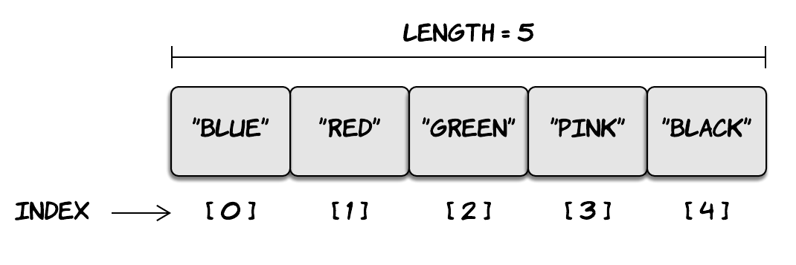

[`Programación con JavaScript`](../Readme.md) > `Sesión 03`

# Sesión 3: Objetos y Arreglos

## Objetivos

Mostrar las principales características de los objetos y arreglos, así como las diferencias con otros tipos de datos

---

## Tabla de Contenidos

- **[Arreglos](#arreglos)**

	- [Ejemplo 1: Arreglos](./Ejemplo-01)

	- [Reto 1: Calcular promedio](./Reto-01)

- **[Objetos](#objetos)**

	- [Ejemplo 2: Transformando objetos en arreglos](./Ejemplo-02)

	- [Reto 2: Arreglo a objeto](./Reto-02)

- **[Spread operator](#spread-operator)**

	- [Copiar iterables](#copiar-iterables)

	- [Unir iterables](#unir-iterables)

	- [Rest parameter](#rest-parameter)

- **[Destructuring](#destructuring)**

	- [Ejemplo 3: Object destructuring](./Ejemplo-03/Readme.md)

	- [Reto 3: Objetos anidados](./Reto-03/Readme.md)
---

## Arreglos

Ya hemos trabajado con distintos tipos de datos como string, number y boolean. Muchas veces necesitamos representar una
colección de variables, en lugar de crear múltiples variables podemos utilizar arreglos.

```javascript
const color1 = 'Red'
const color2 = 'Blue'
const color3 = 'Green'

console.log(color1)  // Red
console.log(color2)  // Blue
console.log(color3)  // Green
```

En lugar de crear tres variables distintas podemos crear un arreglo usando corchetes `[]` y separando cada elemento del
arreglo con comas.

```javascript
const colors = ['Red', 'Blue', 'Green']

console.log(colors)  // ['Red', 'Blue', 'Green']
```

Todo elemento de un arreglo tiene un identificador numérico que representa su posición en el arreglo. A esto se le
conoce como `index` y se empieza a contar desde cero.



Este `index` nos permite acceder a un elemento específico del arreglo.

```javascript
const colors = ['Red', 'Blue', 'Green']

console.log(colors[0])  // 'Red'
console.log(colors[1])  // 'Blue'
console.log(colors[2])  // 'Green'
console.log(colors[3])  // undefined
```

También se pueden manipular los elementos de un arreglo usando su `index`.

```javascript
const colors = ['Red', 'Blue', 'Green']

console.log(colors)  // ['Red', 'Blue', 'Green']

colors[1] = 'Pink'

console.log(colors)  // ['Red', 'Pink', 'Green']
```

Para obtener la longitud del arreglo (cantidad de elementos) utilizamos el método `length`.

```javascript
const colors = ['Red', 'Blue', 'Green']

console.log(colors)  // ['Red', 'Blue', 'Green']

console.log(colors.length)  // 3
```

#### [Ejemplo 1: Arreglos](./Ejemplo-01)

Una variación del ciclo `for` que hemos visto hasta ahora es el ciclo `for...of` que nos permite ejecutar un bloque de
código para cada elemento de un objeto iterable como es el caso de los arreglos. Retomemos el código final
del [ejemplo 1](./Ejemplo-01). 

```javascript
const numbers = [1, 3, 4, 7, 2, 1, 9, 0]

const doubled = []

for(let i = 0; i < numbers.length; i++) {
  doubled.push(numbers[i] * 2);
}

console.log(numbers); // [1, 3, 4, 7, 2, 1, 9, 0]
console.log(doubled);  // [2, 6, 8, 14, 4, 2, 18, 0]
```

Ahora podemos reescribir el ciclo usando `for...of`.

```javascript
const numbers = [1, 3, 4, 7, 2, 1, 9, 0]

const doubled = []

for(const number of numbers) {
  doubled.push(number * 2);
}

console.log(numbers)  // [1, 3, 4, 7, 2, 1, 9, 0]
console.log(doubled)  // [2, 6, 8, 14, 4, 2, 18, 0]
```

Para este ciclo se crea una variable en cada iteración que corresponde al elemento del arreglo. Es decir, `number` es
una variable creada en esa iteración cuyo valor es el equivalente a `numbers[i]`. Cuando usamos `for...of` también
podemos manipular las iteraciones con `break` y `continue` como lo vimos anteriormente.

```javascript
const numbers = [1, 3, 4, 7, 2, 1, 9, 0]

const doubled = []

for(const number of numbers) {
  if (number === 1) continue
  doubled.push(number * 2);
}

console.log(numbers)  // [1, 3, 4, 7, 2, 1, 9, 0]
console.log(doubled)  // [6, 8, 14, 4, 18, 0]
```

#### [Reto 1: Calcular promedio](./Reto-01)

---

## Objetos

En los arreglos utilizamos un índice numérico para acceder a un elemento de la colección. Con los objetos en lugar de
usar valores numéricos como índice utilizamos propiedades con nombre y valor, el cual puede ser cualquier tipo de dato.
Para crear un objeto utilizamos llaves `{}` separando cada propiedad con coma.

```javascript
const john = {
  firstName: 'John',
  lastName: 'Doe',
  birthYear: 1990
}
```

Se puede acceder al valor de una propiedad de dos formas. La primera es con un punto después del nombre del objeto
seguido del nombre de la propiedad que queremos leer, la segunda es usando corchetes `[]` similar a como se hace con los
arreglos pero pasando un string con el nombre de la propiedad en lugar de un `index`.

```javascript
const john = {
  firstName: 'John',
  lastName: 'Doe',
  birthYear: 1990
}

console.log(john.firstName)  // 'John'

console.log(john['lastName'])  // 'Doe'
```

De igual forma se puede cambiar el valor de las propiedades de los objetos.

```javascript
const john = {
	firstName: 'John',
	lastName: 'Doe',
	birthYear: 1990
}

console.log(john.firstName)  // 'John'

john.firstName = 'Jane'

console.log(john.firstName)  // 'Jane'

john['firstName'] = 'Joe'

console.log(john['firstName'])  // 'Joe'
```

#### [Ejemplo 2: Transformando objetos en arreglos](./Ejemplo-02)

En el ejemplo anterior vimos que no podemos iterar un objeto de la manera que lo hacemos con un arreglo. Tuvimos que
extraer en nombre de las propiedades usando el método de JavaScript `Object.keys()` para después iterar sobre el arreglo
que retorna dicho método.

Similar a `for...of` contamos con la instrucción `for...in` que nos permite iterar sobre las propiedades enumerables de
un objeto. Por lo que el código del [ejemplo 2](./Ejemplo-02) puede reescribirse de la siguiente manera.

```javascript
const car = {
  brand: 'Nissan',
  model: 'Versa',
  year: 2020
}

const pairs = []

for(const property in car) {
  pairs.push( [property, car[property]] )
}

console.log(pairs)

// [['brand', 'Nissan'], ['model', 'Versa'], ['year', 2020]]
```

Entonces, `for...of` lo podemos usar para iterar sobre arreglos, mientras que `for...in` lo podemos usar para iterar
sobre las propiedades de un objeto.

#### [Reto 2: Arreglo a objeto](./Reto-02)

---

## Spread operator

El operador de propagación o spread operator hace más fácil trabajar con iterables como arreglos y objetos. La sintaxis
de este operador es `...` y se coloca justo antes de la variable.

### Copiar iterables

Uno de los usos más comunes de este operador es duplicar arreglos. Después de declarar el nombre de la variable usamos
corchetes para asignar un nuevo arreglo y dentro colocamos el spread operator para obtener todos los elementos del
arreglo que queremos copiar.

```javascript
const colors = ['blue', 'red', 'yellow'];
const copyOfColors = [ ...colors ];

console.log(copyOfColors); // ['blue', 'red', 'yellow']
```

En el caso de objetos es casi lo mismo, la única diferencia es el uso de llaves en lugar de corchetes.

```javascript
const book = {
  author: 'Marijn Haverbeke',
  title: 'Eloquent JavaScript',
  year: 2018
};

const copyOfBook = { ...book };

console.log(copyOfBook); 
// { author: "Marijn Haverbeke", title: "Eloquent JavaScript", year: 2018 }
```

### Unir iterables

También podemos usar el spread operator para concatenar arreglos.

```javascript
const oneToThree = [1, 2, 3];
const fourToSix = [4, 5, 6];
const oneToSix = [ ...oneToThree, ...fourToSix ]

console.log(oneToSix); // [1, 2, 3, 4, 5, 6]
```

Ahora `oneToSix` contiene todos los elementos de `oneToThree` y `fourToSix`. Además de concatenar arreglos podemos
usarlo para agregar nuevos elementos en un arreglo.

```javascript
const oneToThree = [1, 2, 3];
const oneToSix = [ ...oneToThree, 4, 5, 6 ]

console.log(oneToSix); // [1, 2, 3, 4, 5, 6]
```

Hay que tomar en cuenta que la posición donde se coloque el spread afecta el orden de los elementos en el arreglo.

```javascript
const oneToThree = [1, 2, 3];
const oneToSix = [ 4, 5, 6, ...oneToThree ]

console.log(oneToSix); // [4, 5, 6, 1, 2, 3]
```

Es muy similar en el caso de objetos.

```javascript
const formalGreetings = {
  english: 'Hello',
  french: 'Bonjour',
};

const informalGreetings = {
  russian: 'Privet',
  portuguese: 'Oi'
}

const greetings = { ...formalGreetings, ...informalGreetings }

console.log(greetings); 
// { english: "Hello", french: "Bonjour", russian: "Privet", portuguese: "Oi" }
```

En el caso de tener propiedades duplicadas se sobrescriben.

```javascript
const formalGreetings = {
  english: 'Hello',
  french: 'Bonjour',
};

const informalGreetings = {
  russian: 'Privet',
  portuguese: 'Oi'
}

const greetings = { 
  ...formalGreetings, 
  ...informalGreetings,
  english: 'Hi' 
}

console.log(greetings); 
// { english: "Hi", french: "Bonjour", russian: "Privet", portuguese: "Oi" }
```

Así como en los arreglos la posición del spread operator afecta el orden de los elementos, en los objetos el orden
del spread operator determina qué propiedad se sobrescribe.

```javascript
const formalGreetings = {
  english: 'Hello',
  french: 'Bonjour',
};

const informalGreetings = {
  russian: 'Privet',
  portuguese: 'Oi'
}

const greetings = { 
  english: 'Hi', 
  ...formalGreetings, 
  ...informalGreetings
}

console.log(greetings); 
// { english: "Hello", french: "Bonjour", russian: "Privet", portuguese: "Oi" }
```

---

## Destructuring

Destructuring es extraer valores o propiedades de un arreglo u objeto.

```javascript
const colors = [ 'Red', 'Blue', 'Yellow' ]

const [ red, blue, yellow ] = colors;

console.log(red); // Red
console.log(blue); // Blue
console.log(yellow); // Yellow
```

En este ejemplo estamos creando 3 variables (`red`, `blue` y `yellow`) y asignando los valores del arreglo `colors`.
Esta asignación se hace basándose en el index del arreglo.

#### [Reto 1: Intercambiar variables](./Reto-01/Readme.md)

```javascript
const person = {
  firstName: 'John',
  lastName: 'Doe',
  country: 'Unknown'
};

const firstName = person.firstName;
const lastName = person.lastName;

console.log(firstName, lastName); // John Doe
```

Este es un caso muy común. En ocasiones queremos crear variables a partir de propiedades de un objeto. Podemos lograr
lo mismo en una sola línea.

```javascript
const person = {
  firstName: 'John',
  lastName: 'Doe',
  country: 'Unknown'
};

const { firstName, lastName } = person;

console.log(firstName, lastName); // John Doe
```

Las llaves del lado izquierdo del `=` no son un objeto. Esta es la sintaxis de object destructuring. Estamos creando dos
nuevas variables `firstName` y `lastName`, después estamos extrayendo dos propiedades de `person` con el mismo nombre de
las variables, el valor de esas propiedades es el que se asigna a las variables creadas.

#### [Ejemplo 3: Object destructuring](./Ejemplo-03/Readme.md)

#### [Reto 3: Objetos anidados](./Reto-02/Readme.md)
