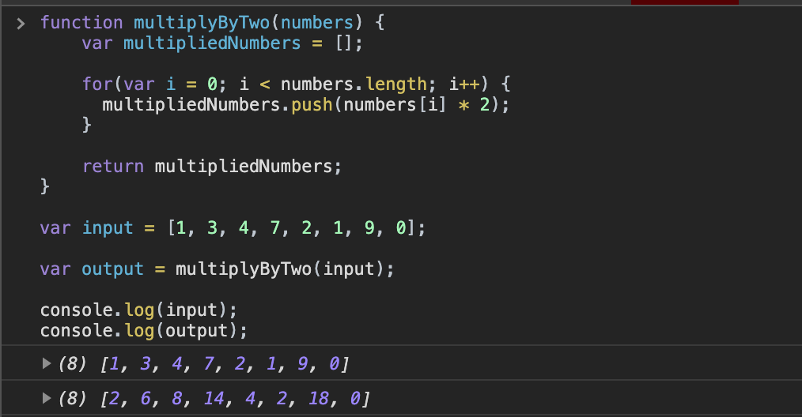

[`Programación con JavaScript`](../../Readme.md) > [`Sesión 04`](../Readme.md) > `Ejemplo 01`

---

## Ejemplo 1: Arreglos

### Objetivo

Distinguir la sintaxis y correcta implementación de los arreglos en JavaScript.

#### Requisitos

En una nueva carpeta vamos a crear un archivo `HTML` en blanco llamado `index.html`:

```html
<html>
  <head>
    <script type="text/javascript" src="./ejemplos-sesion-4.js"></script>
  </head>
</html>
```

Dentro de la misma carpeta creamos un archivo `ejemplos-sesion-4.js` que es donde se trabajarán los ejemplos de esta sesión. Finalmente abre el archivo `index.html` en Chrome e inspecciona la consola para ver los resultados.


#### Desarrollo

Vamos a crear una función que reciba como argumento un arreglo con _n_ cantidad de enteros, dicha función debe retornar un nuevo arreglo con todos los elementos del primer arreglo multiplicados por dos.

```javascript
[1, 3, 4, 7, 2, 1, 9, 0]  // Arreglo inicial

[2, 6, 8, 14, 4, 2, 18, 0]  // Resultado esperado
```

Una forma de resolverlo es recorriendo cada elemento del arreglo con un ciclo `for`, multiplicando el número por dos y guardándalo en un nuevo arreglo para retornarlo al final.

```javascript
function multiplyByTwo(numbers) {
    var multipliedNumbers = [];

    for(var i = 0; i < numbers.length; i++) {
      multipliedNumbers.push(numbers[i] * 2);
    }

    return multipliedNumbers;
}
```

> El método `push()` agrega un nuevo elemento al final de un arreglo.

Como estamos comparando que `i < numbers.length` el ciclo va a terminar con el último elemento del arreglo.

```javascript
function multiplyByTwo(numbers) {
    var multipliedNumbers = [];

    for(var i = 0; i < numbers.length; i++) {
      multipliedNumbers.push(numbers[i] * 2);
    }

    return multipliedNumbers;
}

var input = [1, 3, 4, 7, 2, 1, 9, 0];

var output = multiplyByTwo(input);

console.log(input); // [1, 3, 4, 7, 2, 1, 9, 0]
console.log(output);  // [2, 6, 8, 14, 4, 2, 18, 0]
```


