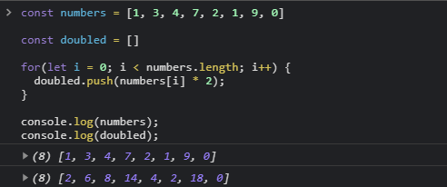

[`Programación con JavaScript`](../../Readme.md) > [`Sesión 03`](../Readme.md) > `Ejemplo 01`

---

## Ejemplo 1: Arreglos

### Objetivo

Distinguir la sintaxis y correcta implementación de los arreglos en JavaScript.

#### Requisitos

En una nueva carpeta vamos a crear un archivo `HTML` en blanco llamado `index.html`:

```html
<html>
  <head>
    <script type="text/javascript" src="./ejemplos-sesion-3.js"></script>
  </head>
</html>
```

Dentro de la misma carpeta creamos un archivo `ejemplos-sesion-4.js` que es donde se trabajarán los ejemplos de esta
sesión. Finalmente abre el archivo `index.html` en Chrome e inspecciona la consola para ver los resultados

#### Desarrollo

Vamos a empezar con un arreglo de enteros llamado `numbers` y otro arreglo `doubled`, este segundo arreglo será
inicializado vacío. Nuestro objetivo será llenar `doubled` con todos los números que se encuentren en `numbers`
multiplicados por dos.

```javascript
const numbers = [1, 3, 4, 7, 2, 1, 9, 0]

const doubled = []
```

Vamos a recorrer cada elemento del arreglo `numbers` con un ciclo `for`, multiplicando el número por dos y lo
agregaremos al arreglo vacío.

```javascript
for(let i = 0; i < numbers.length; i++) {
  doubled.push(numbers[i] * 2)
}
```

> El método `push()` agrega un nuevo elemento al final de un arreglo. Contrario al método `pop()` que elimina el último
> elemento del arreglo cambiando su longitud.

Como estamos comparando que `i < numbers.length` el ciclo va a terminar con el último elemento del arreglo.

```javascript
const numbers = [1, 3, 4, 7, 2, 1, 9, 0]

const doubled = []

for(let i = 0; i < numbers.length; i++) {
  doubled.push(numbers[i] * 2)
}

console.log(numbers)  // [1, 3, 4, 7, 2, 1, 9, 0]
console.log(doubled)  // [2, 6, 8, 14, 4, 2, 18, 0]
```


