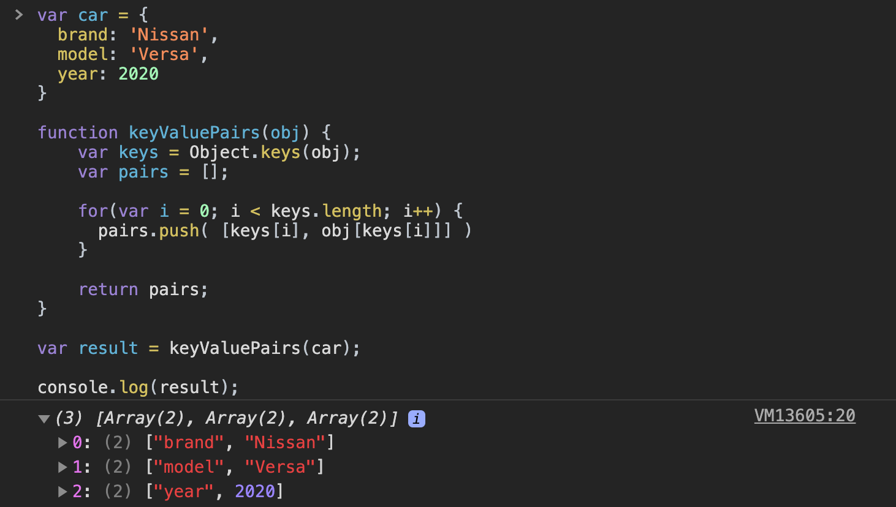

[`Programación con JavaScript`](../../Readme.md) > [`Sesión 04`](../Readme.md) > `Ejemplo 02`

---

## Ejemplo 2: Transformando objetos en arreglos

### Objetivo

Distinguir la sintaxis y correcta implementación de los arreglos en JavaScript.

#### Requisitos

En una nueva carpeta vamos a crear un archivo `HTML` en blanco llamado `index.html`:

```html
<html>
  <head>
    <script type="text/javascript" src="./ejemplos-sesion-4.js"></script>
  </head>
</html>
```

Dentro de la misma carpeta creamos un archivo `ejemplos-sesion-4.js` que es donde
se trabajarán los ejemplos de esta sesión. Finalmente abre el archivo `index.html`
en Chrome e inspecciona la consola para ver los resultados.


#### Desarrollo

Vamos a crear una función que convierta un objeto en un arreglo con los pares
`[key, value]` por cada propiedad.

```javascript
var car = {
  brand: 'Nissan',
  model: 'Versa',
  year: 2020
}

[['brand', 'Nissan'], ['model', 'Versa'], ['year', 2020]]  // Resultado esperado
```

Para resolver este ejercicio haremos uso del método [`Object.keys()`](https://developer.mozilla.org/en-US/docs/Web/JavaScript/Reference/Global_Objects/Object/keys) el cual retorna un arreglo con el nombre de las propiedades de un objeto.

```javascript
var obj = {
  a: 'some string',
  b: 42,
  c: false
};

console.log( Object.keys(obj) );  // ['a', 'b', 'c']
```

Después usaremos un ciclo para ir recorriendo todas las propiedades del objeto e ir obteniendo sus respectivos valores.

```javascript
function keyValuePairs(obj) {
    var keys = Object.keys(obj);
    var pairs = [];

    for(var i = 0; i < keys.length; i++) {
      pairs.push( [keys[i], obj[keys[i]]] )
    }

    return pairs;
}
```

> El método `push()` agrega un nuevo elemento al final de un arreglo.

```javascript
var result = keyValuePairs(car);

console.log(result);

// [['brand', 'Nissan'], ['model', 'Versa'], ['year', 2020]]
```


