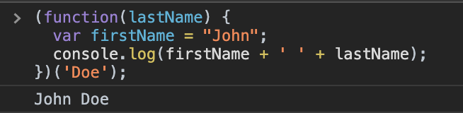

[`Programación con JavaScript`](../../Readme.md) > [`Sesión 03`](../Readme.md) > `Ejemplo 03`

---

## Ejemplo 3: IIFE

### Objetivo

Evaluar otra forma de utilizar expresiones de función al ejecutarlas inmediatamente.

#### Requisitos

En una nueva carpeta vamos a crear un archivo `HTML` en blanco llamado `index.html`:

```html
<html>
  <head>
    <script type="text/javascript" src="./ejemplos-sesion-3.js"></script>
  </head>
</html>
```

Dentro de la misma carpeta creamos un archivo `ejemplos-sesion-3.js` que es donde se trabajarán los ejemplos de esta sesión. Finalmente abre el archivo `index.html` en Chrome e inspecciona la consola para ver los resultados.


#### Desarrollo

Supongamos que tenemos una función que muestra en consola un nombre cualquiera.

```javascript
function logName() {
  var name = "John Doe";
  console.log(name);
}

logName(); // John Doe
```


Para convertir esta función en una IIFE debemos envolver toda la función en paréntesis, eso lo hace una expresión, posteriormente usamos `()` para ejecutar la función justo después de ser definida.

```javascript
(function() {
  var name = "John Doe";
  console.log(name);
})();
```


Como ya fue ejecutada y es anónima, no hay forma de que podamos volver a llamar la función de nuevo.

También se pueden pasar argumentos a este tipo de funciones, de la misma forma que lo hacemos con las funciones normales.

```javascript
(function(lastName) {
  var firstName = "John";
  console.log(firstName + ' ' + lastName);
})('Doe');
```


