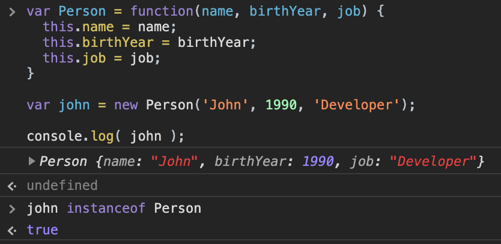

[`Programación con JavaScript`](../../Readme.md) > [`Sesión 05`](../Readme.md) > `Ejemplo 01`

---

## Ejemplo 1: Function constructor

### Objetivo

Crear constructores para instanciar objetos.

#### Requisitos

En una nueva carpeta vamos a crear un archivo `HTML` en blanco llamado `index.html`:

```html
<html>
  <head>
    <script type="text/javascript" src="./ejemplos-sesion-5.js"></script>
  </head>
</html>
```

Dentro de la misma carpeta creamos un archivo `ejemplos-sesion-5.js` que es donde se trabajarán los ejemplos de esta sesión. Finalmente abre el archivo `index.html` en Chrome e inspecciona la consola para ver los resultados.


#### Desarrollo

Ya mencionamos que podemos usar un constructor para crear múltiples objetos como:

```javascript
var john = {
	name: 'John',
	birthYear: 1990,
	job: 'Developer'
}
```

La forma más común de hacer esto es mediante un `function constructor`, el cuál es una expresión de función como la siguiente:

```javascript
var Person = function(name, birthYear, job) {
  this.name = name;
  this.birthYear = birthYear;
  this.job = job;
}
```

> Cuando estamos creando constructores una convención es nombrarlas con la primera letra mayúscula para diferenciar el constructor de las instancias.

Vemos que este constructor recibe tres argumentos los cuáles son las propiedades que queremos que tenga nuestro objeto.

```javascript
var john = new Person('John', 1990, 'Developer');
```

El operador `new` crea un nuevo objeto vacío, después se ejecuta la función `Person()`, esta es la razón por la que el constructor utiliza `this`, está haciendo referencia al nuevo objeto vacío para asignarle las propiedades.

```javascript
console.log( john );
/*
*  {
*    name: 'John',
*    birthYear: 1990,
*    job: 'Developer'
*  }
*/
```

Hemos creado un objeto `john` el cuál es una instancia del constructor `Person`.



De esta manera podemos crear todas las instancias que sean necesarias a partir del mismo construcor.

```javascript
var mark = new Person('Mark', 1985, 'Teacher');

var jane = new Person('Jane', 1975, 'Designer');
```


