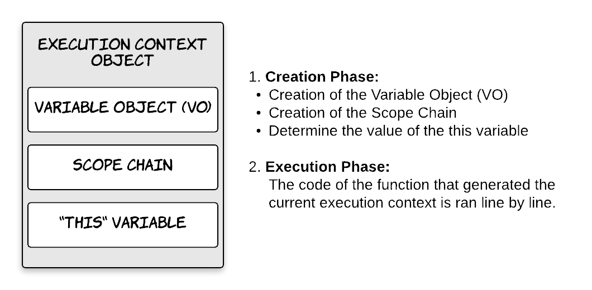
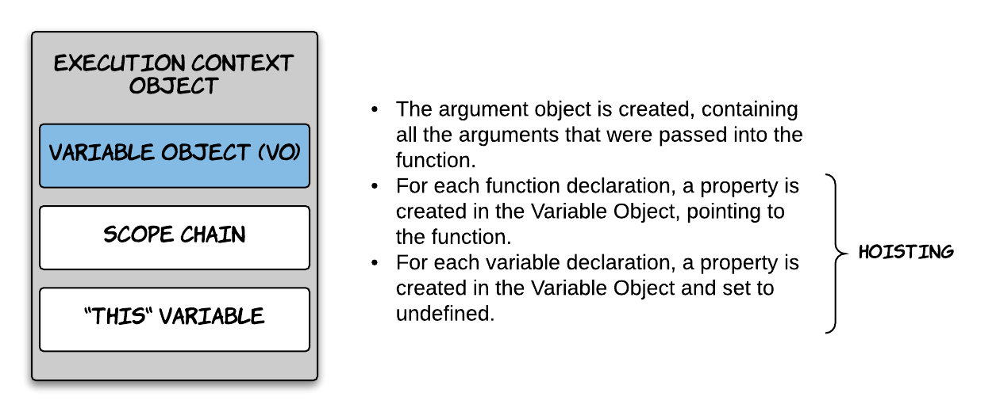
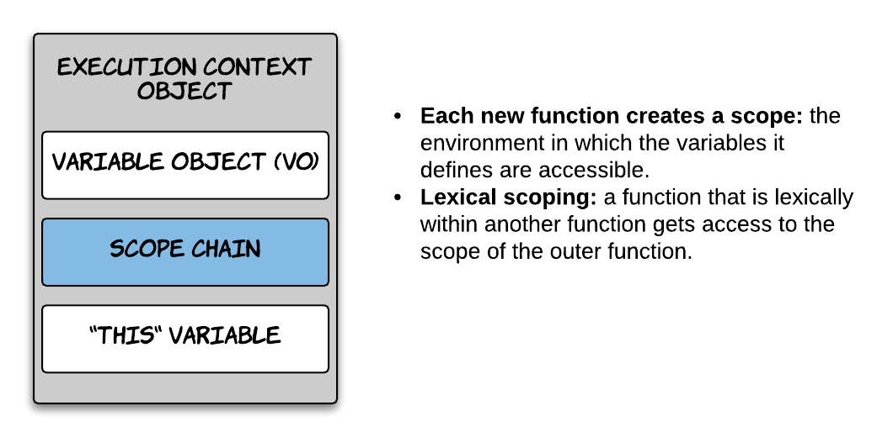
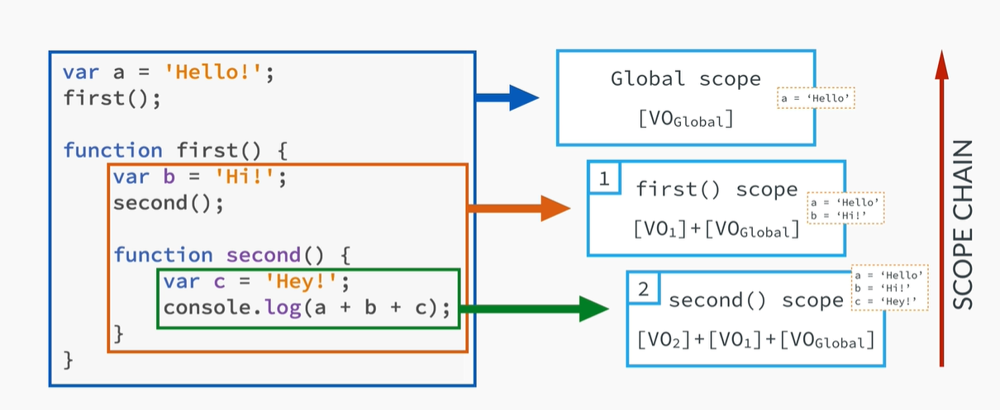
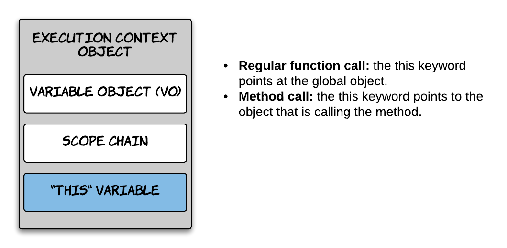

[`Programación con JavaScript`](../../Readme.md) > [`Sesión 05`](../Readme.md) > `Ejemplo 02`

---

## Ejemplo 2: Execution Context a detalle

### Objetivo

Diferenciar Scope de Context y entender a detalle el Execution Context

#### Requisitos

`N/A`

#### Desarrollo

Scope, Context y Execution Context son conceptos que muy fácilmente se confunden entre sí por lo que es bastante
complejo entender la diferencia y cómo funcionan cuando estamos aprendiendo JavaScript. Ya vimos que _Scope_ se refiere
al alcance que tienen las variables, es decir, limita desde dónde podemos acceder a una variable. Por otro lado,
_Context_ se refiere al valor que tiene `this` el cual puede cambiar.

---

### Execution Context a detalle

En la sesión vimos al Execution Context como una caja que envuelve variables donde parte de nuestro código es evaluado y
ejecutado. Podemos asociar el Execution Context con un objeto que tiene tres propiedades: **Variable Object**, el cual
contiene los argumentos de la función, declaraciones de variables internas y declaraciones de funciones.
**Scope Chain**, este contiene el Variable Object del Execution Context actual así como el de los padres. Por último la
variable **this**.

Empecemos con lo que ya sabemos. Cuando una función es llamada un nuevo Execution Context se coloca encima del
Execution Stack y esto sucede en dos fases. La fase de creación que básicamente es crear o inicializar las propiedades
descritas más arriba: Variable Object, Scope Chain y `this`. La segunda fase es la fase de ejecución, aquí se ejecuta
el código de la función línea por línea.

---

### Variable Object

Cuando se crea el Variable Object se genera un objeto que contiene todos los argumentos que se pasaron a la función.
Después, por cada declaración de función se crea una nueva propiedad dentro del VO que apunta a la función en sí. Por
último, por cada declaración de variable se crea una propiedad en el VO y se inicializa la variable como `undefined`.

Los últimos dos pasos es lo que se conoce como Hoisting. En este punto aún no llegamos a la fase de ejecución, es decir,
el código de nuestra función aún no se ejecuta, sin embargo, ya tenemos acceso a las funciones y las variables son
inicializadas con `undefined`.

---

### Scope Chain

En esta fase se crea un nuevo scope por cada función. Además del scope global y el scope local que vimos durante la
sesión, existe el scope léxico. Toda función que se encuentre dentro de otra función tiene acceso al scope de la
función más externa.

De esta forma la función `second` tiene acceso tanto al scope de la función `first` como el scope global. Por lo tanto
tiene acceso a las variables `a` y `b`.

---

### `this` variable

Por último se determina cuál será el valor de `this`. Cuando hablamos de llamadas de funciones regulares, `this` apunta
al objeto global `window` en caso de los navegadores y `global` para el caso de Node.js. Cuando hablamos de un método
entonces `this` apunta al objeto que está llamando el método.

Es importante tomar en cuenta que a `this` no se le asigna valor alguno hasta que la función que lo define es ejecutada. 
