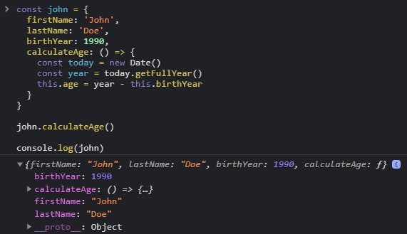

[`Programación con JavaScript`](../../Readme.md) > [`Sesión 05`](../Readme.md) > `Ejemplo 02`

---

## Ejemplo 3: Arrow function y this

Diferenciar el valor de this entre arrow functions y funciones normales

#### Requisitos

En una nueva carpeta vamos a crear un archivo `HTML` en blanco llamado `index.html`:

```html
<html lang="es">
  <head>
    <meta charset="utf-8"/>
    <title>Ejemplo 3: Arrow function y this</title>
  </head>
  <body>
    <script type="text/javascript" src="./ejemplo-2.js"></script>
  </body>
</html>
```

Dentro de la misma carpeta creamos un archivo `ejemplo-2.js` que es donde se trabajarán los ejemplos de esta sesión.
Finalmente abre el archivo `index.html` en Chrome e inspecciona la consola para ver los resultados.

#### Desarrollo

Una característica de los arrow functions que no mencionamos la sesión anterior es que no modifican el valor de `this`,
es decir dentro de un arrow function `this` sigue haciendo referencia a la global `window`.

```javascript
const john = {
  firstName: 'John',
  lastName: 'Doe',
  birthYear: 1990,
  calculateAge: function() {
    const today = new Date()
    const year = today.getFullYear()
    this.age = year - this.birthYear
  }
}
```

Retomemos este ejemplo. Ya vimos que al llamar `john.calculateAge()` se agrega una nueva propiedad `age` al
objeto `john`. Ahora veamos qué sucede si usamos un arrow function.

```javascript
const john = {
  firstName: 'John',
  lastName: 'Doe',
  birthYear: 1990,
  calculateAge: () => {
    const today = new Date()
    const year = today.getFullYear()
    this.age = year - this.birthYear
  }
}
```

Si reescribimos este ejemplo con arrow function no vamos a obtener el mismo resultado. En este caso `this` deja de
apuntar al objeto `john` y toma el valor de más arriba, en este caso el objeto `window`. Esto implica que la
propiedad `age` será agregada a `window` en lugar de `john`.


