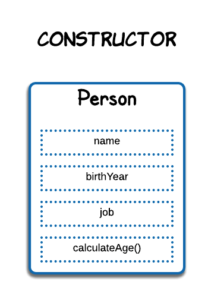
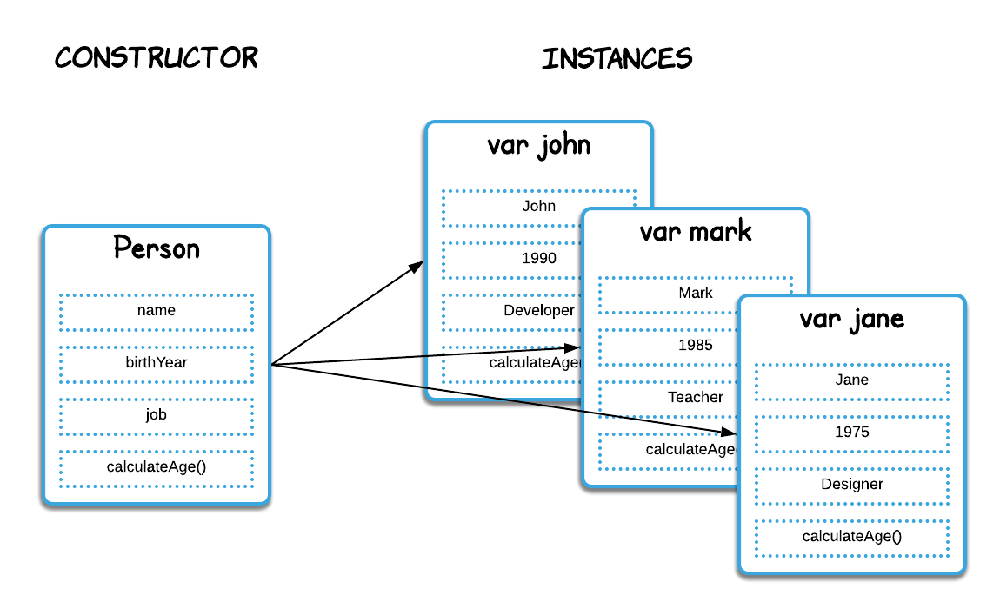

[`Programación con JavaScript`](../Readme.md) > `Sesión 05`

# Sesión 5: Programación orientada a objetos

## Objetivos

Crear constructores a partir de los cuales se puedan instanciar múltiples objetos.

---

## Tabla de Contenidos

- **[Paradigma de programación](#paradigma-de-programación)**

- **[Programación orientada a objetos](#programación-orientada-a-objetos)**

	- [Ejemplo 1: Function constructor](./Ejemplo-01)

	- [Reto 1: Vectores](./Reto-01)

- **[Herencia](#herencia)**

	- [Ejemplo 2: Heredando propiedades](./Ejemplo-02)

	- [Reto 2: Group](./Reto-02)

- **[Prototype](#prototype)**

	- [Ejemplo 3: Heredando métodos](./Ejemplo-03)

	- [Reto 3: Perímetro](./Reto-03)

---

## Paradigma de programación

Un paradigma de programación es una forma de pensar a la hora de hacer tu código.
Es como una receta que nos explica cómo debemos estructurar y organizar el código.
Existen distintos tipos de paradigmas y estos difieren unos de otros en cuanto a
conceptos y la forma de solucionar problemas.

Existen dos grandes categorías en cuanto a estilos de programación, y la mayoría de
paradigmas es una variante de una de estas dos.

<table>
  <tr>
    <th colspan="2">Programación imperativa</th>
  </tr>
  <tr>
    <td colspan="2">Describe paso a paso un conjunto de instrucciones necesarias para solucionar el problema. Se enfoca en describir el <i>cómo</i> se llega a la solución.</td>
  </tr>
  <tr>
    <th>Programación orientada a objetos</th>
    <td>Se encapsulan tanto variables como funciones en objetos. Dichos objetos manipulan los datos de entrada para la obtención de datos de salida específicos. Cada objeto creado ofrece una funcionalidad específica. <strong>Ejemplos:</strong> C++, C#, Java.</td>
  </tr>
  <tr>
    <th colspan="2">Programación declarativa</th>
  </tr>
  <tr>
    <td colspan="2">Se describe el problema que se pretende solucionar. Está más enfocado en el <i>qué</i> solución se desea alcanzar.</td>
  </tr>
  <tr>
    <th>Programación funcional</th>
    <td>Está basado en las funciones matemáticas, lo que permite hacer uso de mecanismos matemáticos para optimizar procesos. Prevalece la inmutabilidad y los datos son usados con transparencia referencial. <strong>Ejemplos:</strong> Erlang, Rust, Haskell.</td>
  </tr>
</table>

Existen también **lenguajes multiparadigma**, es decir, que te permiten crear programas
con múltiples estilos de programación, dándole al desarrollador la flexibilidad de
escoger el mejor paradigma para cada tarea, esto implica que **ningún paradigma resuelve
todos los problemas de la forma más sencilla y eficiente.**

Un claro ejemplo de esto es JavaScript. Si bien se define como un lenguaje orientado
a objetos, también incorpora capacidades de programación funcional.

---

## Programación orientada a objetos

También conocido como OOP por sus siglas en inglés (Object Oriented Programming), es un paradigma imperativo que hace fuerte uso de las propiedades y métodos de los objetos. Múltiples objetos interactuan entre ellos para construir aplicaciones complejas. Permite estructurar las aplicaciones en módulos, una buena forma de organizar y mantener limpio el código.

En la sesión anterior creamos un objeto que representa información personal de una persona.

```javascript
var john = {
	name: 'John',
	birthYear: 1990,
	job: 'Developer'
}
```

Si queremos representar información de más personas tendríamos que crear múltiples objetos de la misma forma.

```javascript
var john = {
	name: 'John',
	birthYear: 1990,
	job: 'Developer'
}

var mark = {
	name: 'Mark',
	birthYear: 1985,
	job: 'Teacher'
}

var jane = {
	name: 'Jane',
	birthYear: 1975,
	job: 'Designer'
}
```

Hay una mejor forma de hacer esto. Imagina una plantilla o un template a partir del cual se pueden crear múltiples objetos.



Este es un objeto `Person` que podemos utilzar como plantilla para crear varios objetos que representen personas. En otros lenguajes de programación a esto se le conoce como clase, en JavaScript le llamamos `Constructor`.



De esta forma podemos crear los objetos que queramos a partir de la plantilla. En este ejemplo decimos que `john`, `mark` y `jane` son instancias del constructor `Person`. Todas las instancias tienen las mismas propiedades y métodos del constructor.

#### [Ejemplo 1: Function constructor](./Ejemplo-01)

#### [Reto 1: Vectores](./Reto-01)

---

## Herencia

En términos simples la herencia es cuando un objeto está basado en otro objeto, es decir, un objeto puede acceder a las propiedades y métodos de otro objeto.


El constructor `Developer` tiene propiedades y métodos únicos cómo skills que domina, años de experiencia y el skill de su preferencia. Como `Developer` también es una persona, es decir, tambíen tiene nombre, edad y un empleo, el constructor `Developer` puede heredar del constructor `Person`, teniendo acceso a las mismas propiedades y métodos.

#### [Ejemplo 2: Heredando propiedades](./Ejemplo-02)

#### [Reto 2: Group](./Reto-02)

---

## Prototype

En JavaScript la herencia es posible gracias a una propiedad con la que cuentan todos los objetos llamada `Prototype`. Si queremos que las instancias hereden un método lo podemos colocar en el `Prototype` del constructor. Veamos un ejemplo con el constructo `Person` y la instancia `john` con la que hemos trabajado anteriormente.


Como `john` es una instancia de `Person`, este tiene acceso al método `calculateAge()` aunque no se encuentre dentro del prototype de `john`. Cuando llamamos a un método, JavaScript busca primero en el prototype del objeto, si no lo encuentra busca en el prototype del constructor con el que fue instanciado, y así sucesivamente hasta llegar al constructor `Object`, del cuál se instancian todos los objetos en JavaScript y [contiene varios métodos](https://developer.mozilla.org/es/docs/Web/JavaScript/Referencia/Objetos_globales/Object). A esto se le conoce como **prototype chain**.

#### [Ejemplo 3: Heredando métodos](./Ejemplo-03)

#### [Reto 3: Perímetro](./Reto-03)
