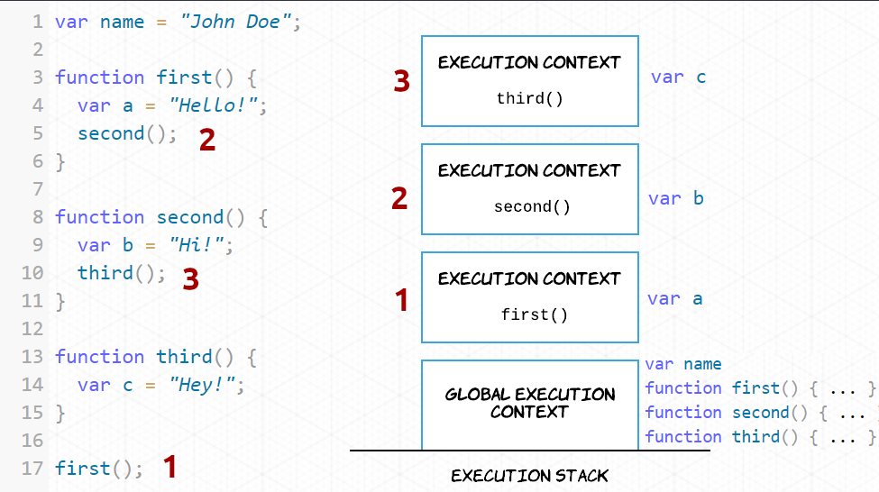
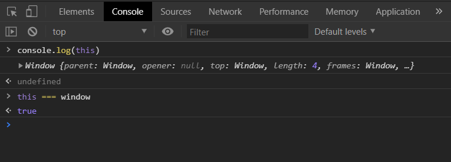
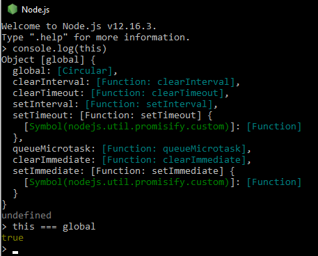

[`Programación con JavaScript`](../Readme.md) > `Sesión 05`

# Sesión 5: Scope y this

## Objetivos

Diferenciar scope global de local y cómo this cambia dependiendo del execution context

---

## Tabla de Contenidos

- **[¿Qué es scope?](#qué-es-scope)**

- **[Scope global](#scope-global)**

- **[Scope local](#scope-local)**

  - [Ejemplo 1: Block Scope](./Ejemplo-01)

- **[Execution context](#execution-context)**

  - [Ejemplo 2: Execution Context a detalle](./Ejemplo-02)

- **[¿Cuál es el valor de `this`?](#cuál-es-el-valor-de-this)**

- **[`this` como método](#this-como-método)**

  - [Ejemplo 3: Arrow function y this](./Ejemplo-03)

  - [Reto 1: Extraer una lista de propiedades](./Reto-01)
  
  - [Reto 2: Crear un número de teléfono](./Reto-02)
  
  - [Reto 3: Encontrar elementos faltantes](./Reto-03)

---

## ¿Qué es scope?

Scope es la accesibilidad que tienen las variables, funciones y objetos en partes específicas del código durante el
tiempo de ejecución. En otras palabras, el scope determina la visibilidad de las variables en áreas del código.

JavaScript cuenta con dos tipos de scope: global y local. Las variables dentro de una función se encuentran en un scope
local, aquellas definidas fuera de una función están en un scope global.

---

## Scope global

Al momento de empezar a escribir en un documento de JavaScript ya estás en un scope global y solamente existe uno todo
el documento. Todas las variables que estén definidas fuera de una función se encuentran en el scope global. Esto
significa que se puede acceder a dichas variables e incluso modificarlas desde cualquier otra parte del código, incluso
dentro de una función.

```javascript
const name = "John Doe";

console.log(name); // "John Doe"

function foo() {
  console.log(name); 
}

foo(); // "John Doe"
```

---

## Scope local

Las variables definidas dentro de una función se encuentran en un scope local, esto significa que solo se puede acceder
a ellas dentro de la función donde se definió la variable. Esto te permite tener variables con el mismo nombre en
distintas funciones, cada una de esas variables estará ligada a su respectiva función.

```javascript
function foo() {
  const bar = "John Doe";
  console.log(bar); 
}

foo(); // "John Doe"

console.log(bar); // Uncaught ReferenceError: name is not defined
```

#### [Ejemplo 1: Block scope](./Ejemplo-01)

---

## Execution context

El ambiente en el cual cada línea de código es ejecutada se conoce como Execution Context. Cada vez que se llama o
ejecuta una nueva función, JavaScript crea un nuevo execution context, estos se van apilando en lo que se conoce como
Execution Stack.



Todas las variables y declaraciones de funciones por default forman parte del Global Execution Context, como es el caso
de `name`, `first`, `second`, y `third`. Al momento de ejecutar `first()` se crea un nuevo execution context encima del
global, después de crear `var a` en este nuevo contexto se ejecuta `second()` y el proceso se repite. El contexto que
esté hasta arriba en la pila es el que se está ejecutando en el momento, una vez que la ejecución finalice se elimina de
la pila y se procede a ejecutar el que sigue, así hasta terminar.

Para evitar confusiones, el **scope se refiere a la visibilidad de variables** mientras que el **contexto se refiere al
valor de `this`**. Es decir, conforme cambia el execution context también lo hace el objeto `this`.

#### [Ejemplo 2: Execution Context a detalle](./Ejemplo-02)

---

## ¿Cuál es el valor de `this`?

Ya mencionamos que la ejecución de un execution context por default es global. Esto significa que `this` por default
está haciendo referencia a un objeto global.

En un navegador o browser este objeto global es `window`.



Mientras que en un ambiente de Node.js `this` hace referencia al objeto `global`.



---

## `this` como método

Ya mencionamos que las propiedades de los objetos pueden contener cualquier tipo de dato, esto incluye expresiones de
funciones, en cuyo caso deja de llamarse propiedad y se conoce como método.

```javascript
const john = {
  firstName: 'John',
  lastName: 'Doe',
  birthYear: 1990,
  calculateAge: function(birthYear) {
    const today = new Date()
    const year = today.getFullYear()
    return year - birthYear
	}
}
```

El objeto `john` contiene el método `calculateAge`. Este método es una expresión de función que recibe `birthYear` como
argumento y retorna la edad actual de `john`.

```javascript
console.log(john.calculateAge(1990))	// 31
```

Ahora bien, como vimos anteriormente por default `this` hace referencia a la global `window`.

```javascript
console.log(this) // Window { … }
```

Incluso dentro de una función `this` sigue apuntando a la global `window`.

```javascript
function foo() {
  console.log(this) 
}

foo() // Window { … }
```

Pero no es el caso cuando se trata de un método de un objeto. Veamos un ejemplo:

```javascript
function logThis () {
  console.log("Is this === window? " + (this === window))
}

const foo = {
  logThis: logThis
}

logThis() // Is this === window? true

foo.logThis() // Is this === window? false
```

Cuando ejecutamos `logThis()` directamente `this` sigue haciendo referencia a `window`. Al llamar `logThis()` como
método de un objeto el valor de `this` cambia, ahora hace referencia al objeto que lo contiene, en este caso el
objeto `foo`.

De esta manera los métodos pueden modificar o agregar nuevas propiedades a los objetos. Podemos reescribir el ejemplo
anterior para usar la propiedad `birthYear` del objeto en lugar de pasarlo al método `calculateAge`.

```javascript
const john = {
  firstName: 'John',
  lastName: 'Doe',
  birthYear: 1990,
  calculateAge: function() {
    const today = new Date()
    const year = today.getFullYear()
    this.age = year - this.birthYear
  }
}
```

Ahora el método `calculateAge` en lugar de retornar la edad la va a guardar en una nueva propiedad llamada `age.`

```javascript
console.log( john );
/*
Valor actual
{
  firstName: "John",
  lastName: "Doe",
  birthYear: 1990,
  calculateAge: ƒ
}
*/

john.calculateAge();

console.log( john );
/*
Después de llamar el método calculateAge()
{
  firstName: "John",
  lastName: "Doe",
  birthYear: 1990,
  age: 31,
  calculateAge: ƒ
}
*/
```

#### [Ejemplo 3: Arrow function y this](./Ejemplo-03)

#### [Reto 1: Extraer una lista de propiedades](./Reto-01)

#### [Reto 2: Crear un número de teléfono](./Reto-02)

#### [Reto 3: Encontrar elementos faltantes](./Reto-03)
