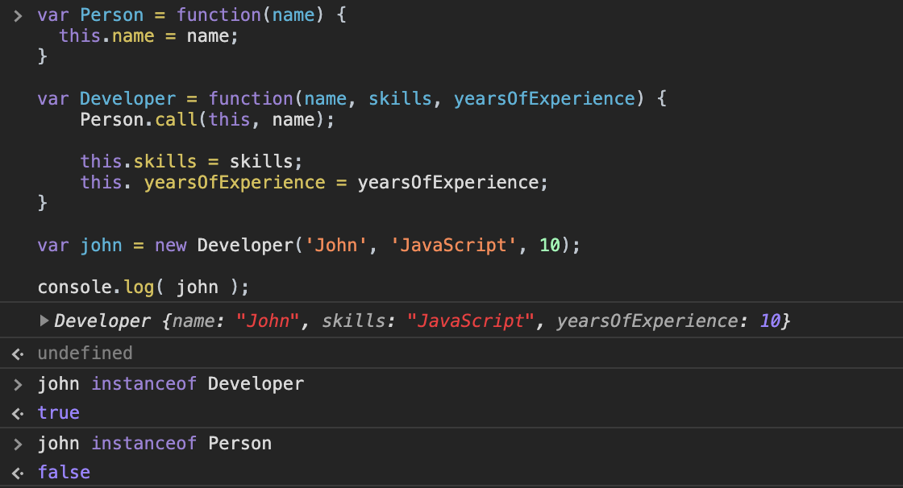

[`Programación con JavaScript`](../../Readme.md) > [`Sesión 06`](../Readme.md) > `Ejemplo 01`

---

## Ejemplo 2: Heredando propiedades

### Objetivo

Crear constructores para instanciar objetos y heredar propiedades entre constructores.

#### Requisitos

En una nueva carpeta vamos a crear un archivo `HTML` en blanco llamado `index.html`:

```html

<html lang="es">
<head>
  <title>Ejemplo 2: Heredando propiedades</title>
  <script type="text/javascript" src="./ejemplo-2.js"></script>
</head>
</html>
```

Dentro de la misma carpeta creamos un archivo `ejemplo-2.js` que es donde se trabajarán los ejemplos de esta
sesión. Finalmente abre el archivo `index.html` en Chrome e inspecciona la consola para ver los resultados.

#### Desarrollo

Ya vimos cómo podemos instanciar objetos a partir del mismo constructor.

```javascript
const Person = function(name) {
  this.name = name;
}

const john = new Person('John');
```

En ocasiones necesitamos que un constructor tenga las propiedades de otro.

```javascript
const Developer = function(skills, yearsOfExperience) {
  this.skills = skills;
  this.yearsOfExperience = yearsOfExperience;
}
```

Con este constructor `Developer` podemos instanciar múltiples objetos que tendrán las propiedades `skils`
y `yearsOfExperience`. Pero también necesitamos la propiedad `name` del constructor `Person`, pues un desarrollador
también es una persona que tiene nombre. Para esto usamos el método `call()` el cual ejecuta el constructor padre.

```javascript
const Person = function(name) {
  this.name = name;
}

const Developer = function(name, skills, yearsOfExperience) {
  Person.call(this, name);

  this.skills = skills;
  this.yearsOfExperience = yearsOfExperience;
}
```

Decimos que el constructor `Developer` es hijo del constructor `Person` porque queremos que `Developer` herede la
propiedad `name` de `Person`.

`Person.call(this, name);` llama al constructor padre y retorna un objeto con todas sus propiedades. `this` en este
contexto está haciendo referencia a `Developer`.

```javascript
const Person = function(name) {
  this.name = name;
}

const Developer = function(name, skills, yearsOfExperience) {
  Person.call(this, name);

  this.skills = skills;
  this.yearsOfExperience = yearsOfExperience;
}

const john = new Developer('John', 'JavaScript', 10);

console.log( john );
```

De esta forma creamos un objeto `john` que es una instancia de `Developer`. Es importante tomar en cuenta que `john` no es una instancia de `Person` aunque tenga sus mismas propiedades, estas sólo fueron prestadas o heredadas durante la creación del objeto.


