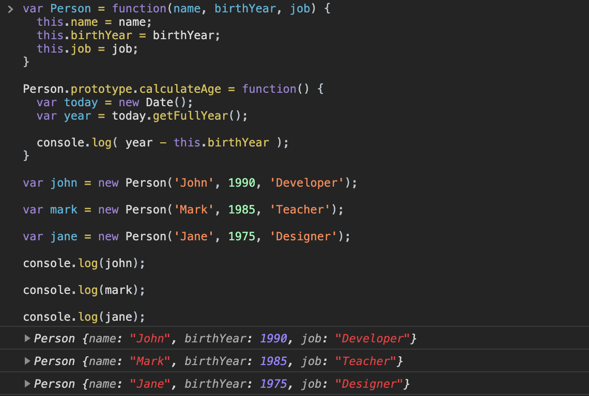
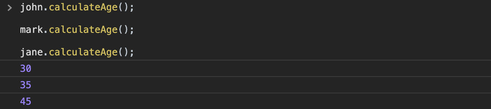

[`Programación con JavaScript`](../../Readme.md) > [`Sesión 06`](../Readme.md) > `Ejemplo 01`

---

## Ejemplo 3: Heredando métodos

### Objetivo

Crear constructores para instanciar objetos y heredar métodos.

#### Requisitos

En una nueva carpeta vamos a crear un archivo `HTML` en blanco llamado `index.html`:

```html

<html lang="es">
<head>
  <title>Ejemplo 3: Heredando métodos</title>
  <script type="text/javascript" src="./ejemplo-3.js"></script>
</head>
</html>
```

Dentro de la misma carpeta creamos un archivo `ejemplo-3.js` que es donde se trabajarán los ejemplos de esta
sesión. Finalmente abre el archivo `index.html` en Chrome e inspecciona la consola para ver los resultados.

#### Desarrollo

En el [Ejemplo 1](../Ejemplo-01) creamos el siguiente constructor:

```javascript
const Person = function(name, birthYear, job) {
  this.name = name;
  this.birthYear = birthYear;
  this.job = job;
}
```

Vamos a agregar un método `calculateAge()` similar al que hicimos la sesión anterior, pero no lo vamos a poner en el
constructor, en su lugar lo vamos a crear dentro del prototype.

```javascript
Person.prototype.calculateAge = function() {
  const today = new Date();
  const year = today.getFullYear();

  console.log( year - this.birthYear );
}
```

Ahora vamos a crear múltiples instancias de `Person`.

```javascript
const john = new Person('John', 1990, 'Developer');

const mark = new Person('Mark', 1985, 'Teacher');

const jane = new Person('Jane', 1975, 'Designer');
```

Si inspeccionamos en consola estos tres objetos nos damos cuenta de que ninguno de ellos tiene el método `calculateAge()`.



Aun así podemos llamar `calculateAge()` en los tres objetos.

```javascript
john.calculateAge();

mark.calculateAge();

jane.calculateAge();
```



Si inspeccionamos más a detalle estos objetos podemos encontrar el método `calculateAge()` dentro de `__proto__` que es
el prototype del objeto. Incluso nos muestra cuál es el contructor del que fue instanciado. De hecho, podemos
inspeccionar todo el prototype chain.


