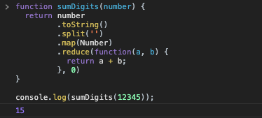

[`Programación con JavaScript`](../../Readme.md) > [`Sesión 06`](../Readme.md) > `Ejemplo 03`

---

## Ejemplo 3: Suma de dígitos

### Objetivo

Implementar múltiples funciones de alto orden para resolver un problema

#### Requisitos

En una nueva carpeta vamos a crear un archivo `HTML` en blanco llamado `index.html`:

```html
<html>
  <head>
    <script type="text/javascript" src="./ejemplos-sesion-6.js"></script>
  </head>
</html>
```

Dentro de la misma carpeta creamos un archivo `ejemplos-sesion-6.js` que es donde se trabajarán los ejemplos de esta sesión. Finalmente abre el archivo `index.html` en Chrome e inspecciona la consola para ver los resultados.


#### Desarrollo

Sumar todos los dígitos de un número entero:

```
Input: 12345

 -- 1 + 2 + 3 + 4 + 5 = 15

Output: 15
```

Este ejercicio puede ser resuelto mediante operadores matemáticos, pero en este ejemplo veremos otra forma implementando múltiples funciones. Lo primero que haremos es crear un arreglo y cada dígito del número será un elemento del arreglo. De esta forma será más fácil trabajar con funciones de alto orden como `filter` y `reduce`.

```javascript
var number = 12345;

var string = number.toString();

var array = string.split('');

console.log(number); // 12345
console.log(string); // '12345'
console.log(array); // ['1', '2', '3', '4', '5']
```

Con el método `toString()` podemos convertir un número entero a un string. El método `split()` nos permite dividir un string en una serie de substrings y colocarlos dentro de un arreglo. En JavaScript podemos encadenar funciones, lo que retorne la primera función será pasada como argumento a la siguiente función, de esta manera podemos simplificar nuestro código.

```javascript
var number = 12345;

var array = number.toString().split('');

console.log(number); // 12345
console.log(array); // ['1', '2', '3', '4', '5']
```

Antes de poder realizar operaciones matemáticas con este arreglo debemos convertir cada elemento a un entero nuevamente. En la sesión uno vimos cómo usar la función `Number()` para convertir un string a un number. Para aplicar esta función a cada elemento del arreglo usaremos la función `map()`.

```javascript
var arrayOfNumbers = array.map(function(number) {
  return Number(number);
})

console.log(arrayOfNumbers); // [1, 2, 3, 4, 5]
```

Cuando usemos una función como `map()` y queremos que retorne el resultado de otra función con el mismo argumento podemos simplificarlo de la siguiente manera:

```javascript
var arrayOfNumbers = array.map(Number);

console.log(arrayOfNumbers); // [1, 2, 3, 4, 5]
```

Por último debemos sumar todos los elementos de este arreglo. Ya vimos cómo podemos usar `reduce` para reducir a un único valor todos los elementos de un arreglo.

```javascript
var sum = arrayOfNumbers.reduce(function(a, b) {
  return a + b;
}, 0);

console.log(sum); // 15
```

Todas estas funciones pueden ser encadenadas de la misma forma que hicimos con las primeras dos. El producto final dentro de una función sería:

```javascript
function sumDigits(number) {
  return number
         .toString()
         .split('')
         .map(Number)
         .reduce(function(a, b) {
           return a + b;
         }, 0)
}

console.log(sumDigits(12345)); // 15
```


