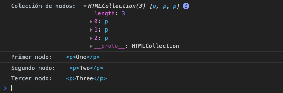

[`Programación con JavaScript`](../../Readme.md) > [`Sesión 07`](../Readme.md) > `Ejemplo 02`

---

## Ejemplo 2: Cambiando el DOM

### Objetivo

Modificar el DOM agregando nodos hijos a un elemento.

#### Requisitos

En una nueva carpeta vamos a crear un archivo `HTML` en blanco llamado `index.html`:

```html
<html>
  <head>
    <title>Ejemplo 2: Cambiando el DOM</title>
  </head>
  <body>
    <p>One</p>
    <p>Two</p>
    <p>Three</p>

    <script>
      // Code goes here
    </script>
  </body>
</html>
```

Opcionalmente se puede manejar el código de JavaScript en un archivo independiente como se ha trabajado en sesiones anteriores.

#### Desarrollo

En este ejemplo vamos a ver cómo cambiar la estructura del DOM. Lo primero es seleccionar todas las etiquetas `p` del documento, esto lo podemos lograr con el método `getElementsByTagName`.

```javascript
var paragraphs = document.body.getElementsByTagName("p");

console.log('Colección de nodos: ', paragraphs);

console.log('Primer nodo: ', paragraphs[0]);
console.log('Segundo nodo: ', paragraphs[1]);
console.log('Tercer nodo: ', paragraphs[2]);
```

Podemos ver en consola que `paragraphs` representa una colección con las tres etiquetas `p` de nuestro documento.



Vamos a cambiar el orden de estos nodos con el método `insertBefore`, el cual recibe dos argumentos, el primero es el nodo a insertar justo antes del nodo proporcionado como segundo argumento.


Al abrir la página vemos que el órden de los párrafos cambia. Un nodo puede existir en el documento en un sólo lugar a la vez, por lo que al insertar `Three` antes de `One` primero se elimina del final de la lista para insertarse al principio. **Todas las operaciones que impliquen insertar nodos tienen como efecto secundario la eliminación del nodo en la posición actual** si es que ya existe en el DOM.
