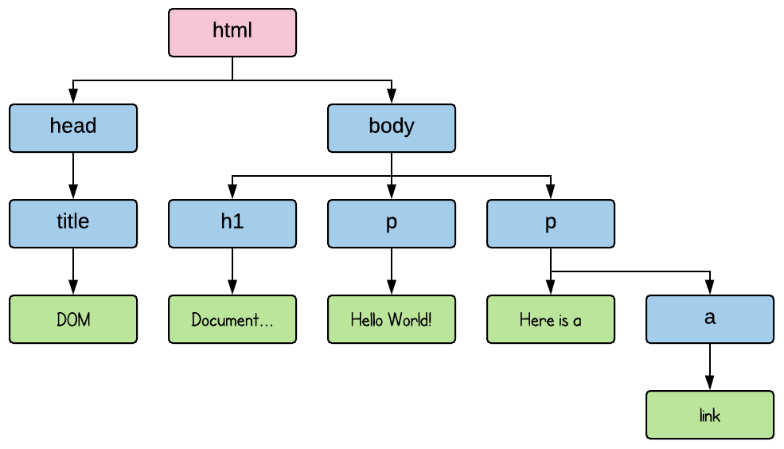

[`Programación con JavaScript`](../Readme.md) > `Sesión 07`

# Sesión 7: Introducción al DOM

## Objetivos

Identificar el rol de JavaScript en el desarrollo web al permitir interactividad entre el usuario y la página web.

---

## Tabla de Contenidos

- **[DOM](#dom)**

	- [Ejemplo 1: Inspeccionando el DOM](./Ejemplo-01)

- **[Estructura de datos de árbol](#estructura-de-datos-de-árbol)**

- **[Seleccionar elementos](#seleccionar-elementos)**

- **[Modificar el documento](#modificar-el-documento)**

	- [Ejemplo 2: Cambiando el DOM](./Ejemplo-02)

- **[Crear nodos](#crear-nodos)**

	- [Ejemplo 3: Crear nuevos nodos](./Ejemplo-03)

- **[Atributos](#atributos)**

	- [Reto 1: Reemplazar imágenes](./Reto-01)

	- [Reto 2: Crear una tabla](./Reto-02)

---

## ¿Qué es el DOM?

Cuando abres una página web el navegador obtiene el código HTML y lo analiza para construir un modelo de la estructura del documento, este modelo le permite al navegador mostrar la página en la pantalla.

A esto se le conoce como DOM (Document Object Model), una representación del documento que se muestra en el navegador. Esta estructura puede ser leída y modificada en tiempo real, es decir, cualquier cambio que se haga a este modelo será reflejada en la pantalla en el momento.

Un documento HTML es como una serie de cajas anidadas. Las etiquetas como `<body> </body>` encierran otras etiquetas, y estas a su vez envuelven otras etiquetas o texto. Tomemos como ejemplo el siguiente documento HTML:

```html
<!doctype html>
<html>
  <head>
    <title>DOM</title>
  </head>
  <body>
    <h1>Document Object Model</h1>
    <p>Hello World!</p>
    <p>Here is a
      <a href="#">link</a>
    </p>
  </body>
</html>
```

Esta es la estructura de esa página:


Para cada una de estas cajas existe un objeto en JavaScript con el que podemos interactuar para saber qué etiqueta HTML representa y qué otras cajas o texto contiene. La variable global `document` nos da acceso a todos estos objetos.

> `document` es una variable global, es decir, se puede acceder a ella desde cualquier parte del script o código. Todas las funciones que hagas pueden hacer referencia a esta variable.

#### [Ejemplo 1: Inspeccionando el DOM](./Ejemplo-01)

---

## Estructura de datos de árbol

Esta estructura de datos imita la estructura jerárquica de un árbol. Es una colección de nodos con un único nodo padre o raíz. Es muy útil para mantener una colección de datos ordenada, ya que es más fácil seleccionar o insertar elementos en un árbol que en un arreglo plano.

El DOM es una estructura de datos de árbol, y es común nombrarlo también un árbol de nodos. Cada nodo representa una etiqueta de HTML, siendo `document.documentElement` la raíz del árbol, el cuál representa la etiqueta `html`. Cada nodo puede tener nodos hijos (children) o ser un nodo hoja (último elemento de la rama) como el texto dentro de una etiqueta `p`.

Esta es otra forma de visualizar el ejemplo que vimos anteriormente:



`html` es el nodo raíz del árbol. Los nodos hojas son los últimos nodos de la rama, los elementos de texto. Las flechas indican una relación padre-hijo entre nodos.

Los nodos del DOM contienen vínculos entre ellos como los que se muestran en el siguiente diagrama:


Todos los nodos tienen una propiedad `parentNode` que apunta al nodo que lo contiene. La propiedad `childNodes` apunta a un objeto parecido a un arreglo que contiene los hijos del nodo. Las propiedades `firstChild` y `lastChild` apuntan al primer y último nodo hijo respectivamente o `null` si no tienen. De igual forma, `previousSibling` y `nextSibling` apuntan a los nodos hermanos, es decir, los nodos adyacentes que comparten el mismo padre.

---

## Seleccionar elementos

Si bien navegar entre nodos padres, hijos y hermanos con las propiedades vistas anteriormente es útil, no es lo más óptimo si queremos encontrar un nodo en particular y partimos desde `document.body`. La estructura del DOM podría cambiar en cualquier momento, además los nodos de texto son creados incluso para espacios en blanco entre nodos. En nuestro ejemplo, el nodo `body` no tiene sólo tres hijos (`<h1>` y dos `<p>`), en realidad tiene siete: los tres que ya vimos más los espacios en blanco antes, después y entre nodos.

Si queremos obtener el link `<a>` de nuestro ejemplo, empezar a recorrer los nodos desde `body` sería como decir que queremos _obtener el segundo hijo del sexto hijo de `body`_. Sería mucho más sencillo decir que queremos _obtener el primer link del documento_.

```javascript
var link = document.body.getElementsByTagName('a')[0];

console.log(link);  //  <a href="#">link</a>
```

El método `getElementsByTagName` regresa un objeto similar a un arreglo con todos los elementos descendientes que contengan la etiqueta proporcionada como argumento.

> Elementos descendientes se refiere a todos los nodos hijos directos e indirectos.

Para seleccionar un sólo nodo en específico podemos darle un atributo `id` y usar el método `document.getElementById`.

```html
<body>
  <h1 id="title">Document Object Model</h1>
  <p>Hello World!</p>
  <p>Here is a
    <a href="#">link</a>
  </p>

  <script>
    var title = document.getElementById('title');
    console.log(title); // <h1 id="title">Document Object Model</h1>
  </script>
</body>
```

Otra forma de seleccionar elementos es con el método `getElementsByClassName`, muy parecido a `getElementsByTagName`, busca en los descendientes de un nodo todos los elementos que contengan el string proporcionado en el atributo `class`.

```html
<body>
  <h1>Document Object Model</h1>
  <p class="subtitle">Hello World!</p>
  <p>Here is a
    <a href="#">link</a>
  </p>

  <script>
    var subtitle = document.body.getElementsByClassName('subtitle')[0];
    console.log(subtitle); // <p class="subtitle">Hello World!</p>
  </script>
</body>
```

---

## Modificar el documento

Casi todo en el DOM puede ser modificado. La estructura del árbol puede ser alterada al cambiar las relaciones padre-hijo. Todos los nodos contienen el método `remove` que los elimina del padre actual. También se pueden agregar hijos a un nodo usando el método `appendChild`, el cual agrega un elemento al final de la lista de hijos de un nodo. Otro método es `insertBefore` el cual inserta un nodo antes de otro.

El método `replaceChild` se puede usar para reemplazar un nodo hijo por otro. Es importante tomar en cuenta que tanto `replaceChild` como `insertBefore` reciben dos argumentos, el primero siempre es el nuevo nodo.

#### [Ejemplo 2: Cambiando el DOM](./Ejemplo-02)

---

## Crear nodos

Parte importante de manipular el DOM es poder crear nuevos nodos para ser insertados posteriormente en el documento con métodos como los vistos anteriormente. JavaScript nos proporciona el método `document.createElement` el cual crea un nuevo nodo vacío del tipo que sea especificado en el argumento de la función.

```javascript
var h1 = document.createElement('h1');

console.log(h1);  // <h1></h1>
```

Para agregar un texto a este nuevo nodo `h1` primero debemos crear un nuevo nodo de texto, para esto usamos el método `document.createTextNode`, posteriormente lo podemos agregar como hijo de `h1` con el método `appendChild`.

```javascript
var text = document.createTextNode('Hello World');

console.log(text);  // 'Hello World'

h1.appendChild(text);

console.log(h1);  // <h1>Hello World</h1>
```

#### [Ejemplo 3: Crear nuevos nodos](./Ejemplo-03)

---

## Atributos

Hasta ahora hemos creado elementos del DOM que representan etiquetas HTML. Algunas de estas etiquetas requieren de atributos, por ejemplo el atributo `href` para los hipervínculos. Los objetos del DOM cuentan con propiedades del mismo nombre del atributo que nos permiten leer o modificar su valor.

```html
<a id="link">Some cool link</a>

<script>
  var link = document.getElementById('link');

  link.href = "http://google.com"

  console.log(link); // <a id="link" href="http://google.com">Some cool link</a>
</script>
```

Un atributo muy utilizado es `class` para darle estilos a una etiqueta. Esta es una palabra reservada en JavaScript, por lo que debemos usar `className` en su lugar.

```html
<a id="link">Some cool link</a>

<script>
  var link = document.getElementById('link');

  link.href = "http://google.com"

  link.className = "styled-link"

  console.log(link); // <a id="link" href="http://google.com" class="styled-link">Some cool link</a>
</script>
```

#### [Reto 1: Reemplazar imágenes](./Reto-01)

#### [Reto 2: Crear una tabla](./Reto-02)
