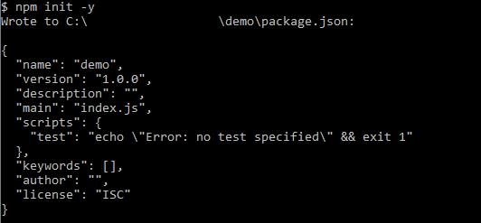
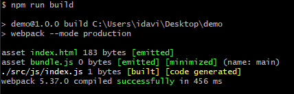

[`Programación con JavaScript`](../../Readme.md) > [`Sesión 08`](../Readme.md) > `Ejemplo 01`

---

## Ejemplo 1: Instalación y configuración

### Objetivo

Instalar y configurar webpack

#### Requisitos

Para este ejemplo necesitamos contar con la siguiente estructura de carpetas y archivos:

```
demo
|- /src
    |- index.html
    |- js
      |- index.js
```

#### Desarrollo

Para poder usar webpack debemos primero inicializar npm. Desde la consola o terminal debemos ejecutar `npm init -y`
estando en la ruta donde se encuentra la carpeta recién creada. Esto nos mostrará un mensaje confirmando que se creó el
archivo `package.json`



Ahora instalamos las siguientes librerías:

```text
npm install --save-dev webpack webpack-cli html-webpack-plugin
```

- **webpack:** Esta es la librería principal. [Documentación](https://webpack.js.org/)
- **webpack-cli:** Nos permite ejecutar webpack desde la línea de
  comandos. [Documentación](https://webpack.js.org/api/cli/)
- **html-webpack-plugin:** Simplifica la creación de archivos HTML que ejecuten bundles de
  webpack. [Documentación](https://webpack.js.org/plugins/html-webpack-plugin/)

En la raíz del proyecto (al mismo nivel de `package.json`) vamos a crear un archivo de configuración llamado
`webpack.config.js`, aquí definiremos el punto de entrada y el output.

```javascript
const path = require('path');

module.exports = {
  entry: './src/js/index.js',
  output: {
    path: path.resolve(__dirname, 'dist'),
    filename: 'bundle.js'
  }
}
```

Ahora importamos `HtmlWebpackPlugin` y lo agregamos a la propiedad `plugins`.

```javascript
const path = require('path');
const HtmlWebpackPlugin = require('html-webpack-plugin');

module.exports = {
  entry: './src/js/index.js',
  output: {
    path: path.resolve(__dirname, 'dist'),
    filename: 'bundle.js'
  },
  plugins: [
    new HtmlWebpackPlugin({
      filename: 'index.html',
      template: './src/index.html'
    })
  ]
}
```

En nuestro archivo HTML agregaremos una estructura sencilla.

```html
<!DOCTYPE html>
<html lang="en">
<head>
  <meta charset="UTF-8">
  <title>Webpack setup</title>
</head>
<body>
  <h1>Webpack Setup</h1>
</body>
</html>
```

Por último vamos a reemplazar los scripts de nuestro `package.json`.

```json
"scripts": {
  "build": "webpack --mode production"
}
```

Con este script podemos ejecutar `npm run build` en la línea de comandos para generar el bundle.


