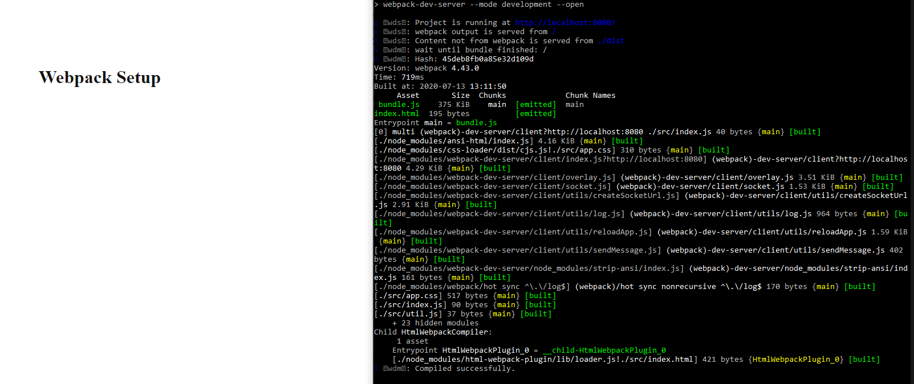

[`Programación con JavaScript`](../../Readme.md) > [`Sesión 08`](../Readme.md) > `Ejemplo 02`

---

## Ejemplo 2: Webpack DevServer

### Objetivo

Instalar y configurar webpack dev server

#### Requisitos

Continuar con el código del ejemplo 1

#### Desarrollo

Webpack Dev Server nos puede ahorrar tiempo de desarrollo. Cada vez que guardemos algún cambio en nuestro código webpack
automáticamente creará un bundle y abrirá nuestra aplicación en el navegador. Así no tenemos que generar el build
manualmente cada vez que hagamos cambios.

Empecemos instalando la librería.

```text
npm install --save-dev webpack-dev-server
```

En nuestro archivo de configuración de webpack vamos a agregar la propiedad `devServer`.

```javascript
const path = require('path');
const HtmlWebpackPlugin = require('html-webpack-plugin');

module.exports = {
  entry: './src/js/index.js',
  output: {
    path: path.resolve(__dirname, 'dist'),
    filename: 'bundle.js'
  },
  plugins: [
    new HtmlWebpackPlugin({
      filename: 'index.html',
      template: './src/index.html'
    })
  ],
  devServer: {
    contentBase: path.resolve(__dirname, 'dist')
  }
}
```

Con la propiedad `contentBase` le decimos a webpack qué carpeta queremos que use al iniciar el servidor local. Recuerda
que `src` es nuestro código fuente, es aquí donde desarrollamos la aplicación. La carpeta `dist` es código final para
distribución.

Lo siguiente es agregar un nuevo script en `package.json` que usaremos para iniciar webpack dev server.

```json
"scripts": {
  "start": "webpack serve --mode development --open",
  "build": "webpack --mode production"
}
```

La opción `--open` es para abrir el HTML inmediatamente. Ahora podemos ejecutar `npm run start` para iniciar un servidor
local con webpack. Cualquier cambio que se haga al código generará un nuevo bundle y actualizará el navegador
automáticamente.


