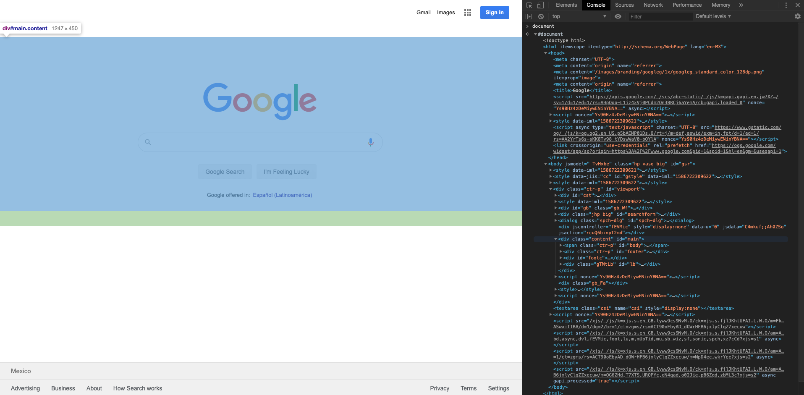

[`Programación con JavaScript`](../../Readme.md) > [`Sesión 07`](../Readme.md) > `Ejemplo 01`

---

## Ejemplo 1: Inspeccionando el DOM

### Objetivo

Identificar de manera práctica la variable global `document` como representación del código HTML.

#### Requisitos

Visitar cualquier página web y abrir la consola del navegador. Para este ejemplo trabajaremos sobre la página de [Google](https://www.google.com/).

#### Desarrollo

En la consola vamos a poner la variable global `document`. Esto nos va a mostrar un objeto que representa la página web, contiene todas las etiquetas HTML de la página.

Si seguimos expandiendo las etiquetas podemos ver cómo se selecciona en la pantalla el área que representa el objeto o la etiqueta por la que estamos pasando el mouse.

Es importante recordar que aunque se muestre como si fuera código HTML en la consola, `document` es un objeto de JavaScript, y todas las etiquetas dentro de este también son objetos. Más adelante veremos cómo podemos manipular estos objetos y ver los cambios reflejados en la pantalla.
