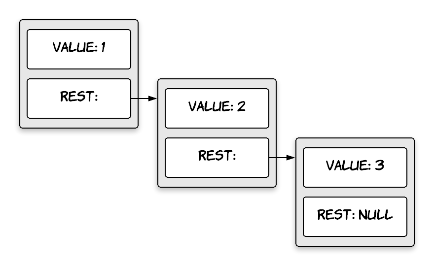

[`Programación con JavaScript`](../../Readme.md) > [`Sesión 09`](../Readme.md) > `Postwork`

---

## Postwork

### Objetivos

Diferenciar el uso de arrow functions sobre funciones regulares.

### Desarrollo

Arrow functions es sin duda una de las características más llamativas de ES6. Después de ver la simplicidad de la
sintaxis y las ventajas de su uso, debemos entender que no reemplazan las funciones regulares.

Estos son algunos casos en los que definitivamente no deberíamos usar arrow functions.

#### Métodos de un objeto

```javascript
const cat = {
  lives: 9,
  jumps: () => {
    this.lives--;
  }
}

console.log(cat.lives); // 9

cat.jumps()

console.log(cat.lives); // 9
```

Después de llamar `cat.jumps` esperaríamos que `lives` disminuya su valor en uno. Este no es el caso porque `this` no
está ligado a nada dentro de la función por lo que hereda el valor de `this` del scope padre, que en este caso viene
siendo el objeto global `window`.

#### Object prototype

```javascript
function Person(name) {
	this.name = name;
}

Person.prototype.getName = () => {
  return this.name;
}

const john = new Person('John');

console.log(john.getName()); // "" <- undefined
```

Similar al caso anterior, `this` está haciendo referencia a `window` por lo que obtenemos `undefined` ya que `name` no
se encuentra en `window`.

#### Function Constructor

```javascript
const Person = (name) => {
  this.name = name; 
}

const john = new Person('John');
// TypeError: Person is not a constructor
```

El operador `new` crea un nuevo objeto vacío, después se ejecuta la función `Person` y en este contexto `this` permite
que el constructor asigne las propiedades ya que apunta al objeto vacío. Como los arrow functions no tienen un `this`
propio no pueden usarse para crear function constructors.

#### Callback con un contexto dinámico

```javascript
const button = document.getElementById('myButton');
button.addEventListener('click', () => {
  this.innerHTML = 'Clicked button';
});
```

Este es el caso cuando estamos trabajando con event listeners en elementos del DOM. Aquí el contexto `this` no cambia
cuando se declara el arrow function por lo que sigue apuntando a `window`.

---

### Ejercicios

#### Deep Comparison

El operador == compara objetos por identidad. En ocasiones lo que necesitamos es comparar los valores de sus
propiedades.

Crear una función `deepEqual` que recibe dos argumentos y retorne `true` solo en los siguientes casos:
- Ambos son el mismo valor y tipo de dato.
- Los dos son objetos, tienen las mismas propiedades y los valores son iguales cuando se comparan con una llamada
  recursiva de `deepEqual`.

Puedes usar el operador `typeof` para saber si los argumentos son objetos. Si retorna `"object"` entonces se debe hacer una
comparación recursiva. Toma en cuenta una excepción, cuando usamos `typeof` sobre `null` recibimos `"object"` pese a que
no es un objeto.

```javascript
function deepEqual(a, b) {
  // Code goes here
}

let obj = { here: { is: "an" }, object: 2 };

console.log(deepEqual(obj, obj)); // true

console.log(deepEqual(obj, { here: 1, object: 2 })); // false

console.log(deepEqual(obj, { here: { is: "an" }, object: 2 })); // true
```

<details>
  <summary>Solución</summary>

```javascript
function deepEqual(a, b) {
  if (a === b) return true;
  
  if (a == null || typeof a != "object" ||
      b == null || typeof b != "object") return false;

  let keysA = Object.keys(a), keysB = Object.keys(b);

  if (keysA.length !== keysB.length) return false;

  for (let key of keysA) {
    if (!keysB.includes(key) || !deepEqual(a[key], b[key])) return false;
  }

  return true;
}
```

</details>

#### List

Una lista es una serie de objetos anidados donde el primero tiene una referencia al segundo, el segundo al tercero y
así sucesivamente hasta llegar al último objeto de la lista.



Esta forma de encadenar objetos se puede ver de la siguiente manera:

```javascript
const list = {
  value: 1,
  rest: {
    value: 2,
    rest: {
      value: 3,
      rest: null
    } 
  }
}
```

Crear una función `arrayToList` que construya una estructura como la anterior cuando recibe un arreglo.

Crear una función `listToArray` que hace lo opuesto a la anterior.

Después crear dos funciones auxiliares, `prepend` que toma un elemento y una lista para crear una nueva lista agregando
el elemento al principio de la lista que se recibió como argumento. Y la función recursiva `nth` que recibe una lista y
un número para retornar el elemento en la posición indicada por el número (cero debe ser el primer elemento de la lista)
o `undefined` si no existe dicho elemento.

```javascript
function arrayToList(array) {
  // Code goes here
}

function listToArray(list) {
  // Code goes here
}

function prepend(value, list) {
  // Code goes here
}

function nth(list, n) {
  // Code goes here
}

console.log(arrayToList([1, 2]));
// {value: 1, rest: {value: 2, rest: null}}

console.log(listToArray(arrayToList([1, 2, 3])));
// [1, 2, 3]

console.log(prepend(1, prepend(2, null)));
// {value: 1, rest: {value: 2, rest: null}}

console.log(nth(arrayToList([1, 2, 3]), 1));
// 2
```

<details>
  <summary>Solución</summary>

```javascript
function arrayToList(array) {
  let list = null;
  
  for (let i = array.length - 1; i >= 0; i--) {
    list = { value: array[i], rest: list };
  }
  
  return list;
}

function listToArray(list) {
  let array = [];
  
  for (let node = list; node; node = node.rest) {
    array.push(node.value);
  }
  
  return array;
}

function prepend(value, list) {
  return { value, rest: list };
}

function nth(list, n) {
  if (!list) return undefined;
  else if (n === 0) return list.value;
  else return nth(list.rest, n - 1);
}
```

</details>
