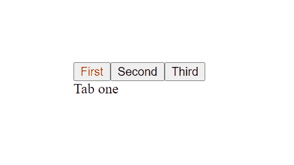

[`Programación con JavaScript`](../../Readme.md) > [`Sesión 10`](../Readme.md) > `Reto 03`

---

## Reto 3: Navegando entre tabs

### Objetivos

Implementar event handlers para crear tabs de navegación.

#### Requisitos

Partir del siguiente documento HTML:

```html
<html>
<head>
  <meta charset="utf8"/>
  <title>Reto 3: Navegando entre tabs</title>
</head>
<body>

<div id="tab-panel">
  <div data-tabname="First">Tab one</div>
  <div data-tabname="Second">Tab two</div>
  <div data-tabname="Third">Tab three</div>
</div>

<script>
  function createTabs(node) {
    // Code goes here
  }
</script>
</body>
</html>
```

#### Desarrollo

Crear una función `createTabs` que recibe un nodo del DOM y genera una interfaz de tabs de navegación.

- La función debe insertar una lista de elementos `<button>` al principio del nodo. 
- Se debe crear un botón por cada nodo hijo. 
- El texto del botón será el valor del atributo `data-tabname`. 
- Solamente se debe mostrar uno de los hijos a la vez y este debe cambiar dependiendo del botón seleccionado. 
- La visibilidad de los elementos la puedes controlar con `display: none` y `display: block`.

Por último, cambiar el color de texto del botón que esté seleccionado para que sea visible cuál tab es el que se
encuentra activo.


