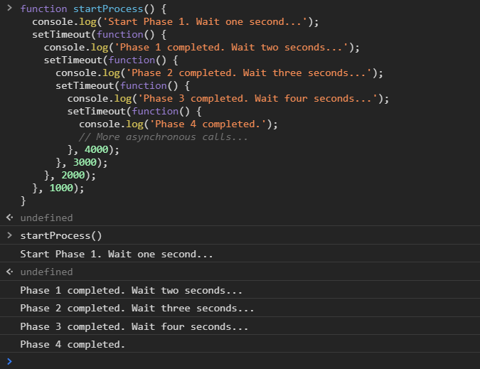

[`Programación con JavaScript`](../../Readme.md) > [`Sesión 11`](../Readme.md) > `Ejemplo 01`

---

## Ejemplo 1: Callback hell

### Objetivo

Implementar múltiples funciones asíncronas mediante callbacks

#### Requisitos

Crear un archivo `index.html` con la siguiente estructura:

```html

<html>
<head>
  <meta charset="utf-8"/>
  <title>Ejemplo 1: Callback hell</title>
</head>
<body>
<script type="text/javascript" src="./ejemplo-1.js"></script>
</body>
</html>
```

Dentro de la misma carpeta creamos un archivo `ejemplo-1.js` que es donde se trabajará este ejemplo. Finalmente abre el
archivo `index.html`
en Chrome e inspecciona la consola para ver los resultados.

#### Desarrollo

La siguiente función nos muestra un mensaje al iniciar el proceso y otro mensaje después de un segundo.

```javascript
function startProcess() {
  console.log('Start Phase 1. Wait one second...');
  setTimeout(function () {
    console.log('Phase 1 completed.');
  }, 1000);
}

startProcess();
```

Los callbacks pueden ejecutar otras funciones asíncronas.

```javascript
function startProcess() {
  console.log('Start Phase 1. Wait one second...');
  setTimeout(function () {
    console.log('Phase 1 completed. Wait two seconds...');
    setTimeout(function () {
      console.log('Phase 2 completed.');
    }, 2000);
  }, 1000);
}

startProcess();
```

Podemos continuar anidando funciones asíncronas tanto como sea necesario.

```javascript
function startProcess() {
  console.log('Start Phase 1. Wait one second...');
  setTimeout(function () {
    console.log('Phase 1 completed. Wait two seconds...');
    setTimeout(function () {
      console.log('Phase 2 completed. Wait three seconds...');
      setTimeout(function () {
        console.log('Phase 3 completed. Wait four seconds...');
        setTimeout(function () {
          console.log('Phase 4 completed.');
          // More asynchronous calls...
        }, 4000);
      }, 3000);
    }, 2000);
  }, 1000);
}

startProcess();
```

A esto se le conoce como callback hell. Al continuar anidando varios callbacks comenzamos a restar legibilidad a nuestro
código, encontrar bugs y resolverlos se hace más tedioso, en general estamos agregando complejidad ciclomática.

> Complejidad ciclomática es una métrica que mide el número de caminos o flujos independientes dentro de un fragmento
> de código. Entre mayor sea esta métrica el código es más complejo, difícil de leer, entender, modificar y mantener.


