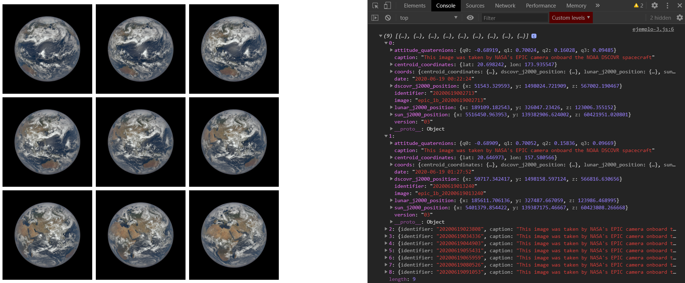

[`Programación con JavaScript`](../../Readme.md) > [`Sesión 12`](../Readme.md) > `Ejemplo 01`

---

## Ejemplo 1: NASA API

### Objetivo

Obtener imágenes consumiendo la API pública de la NASA

#### Requisitos

Crear un archivo `index.html` con la siguiente estructura:

```html
<html>
<head>
  <meta charset="utf-8"/>
  <title>Ejemplo 1: NASA API</title>
  <style>
    #app img {
      height: 250px;
      margin: 5px;
    }
  </style>
</head>
<body>

<div id="app"></div>

<script type="text/javascript" src="./ejemplo-1.js"></script>
</body>
</html>
```

Dentro de la misma carpeta creamos un archivo `ejemplo-1.js` que es donde se trabajará este ejemplo. Finalmente abre el
archivo `index.html`
en Chrome e inspecciona la consola para ver los resultados.

#### Desarrollo

Toda API tiene documentación donde se describe qué recursos se encuentran disponibles y cómo podemos acceder a ellos. En
este ejemplo estaremos usando la <a target="_blank" href="https://epic.gsfc.nasa.gov/about/api">API de la NASA<a/> para
obtener imágenes recientes de la tierra y mostrarlas en pantalla.

```javascript
fetch('https://epic.gsfc.nasa.gov/api/natural')
  .then(function (response) {
    return response.json();
  })
  .then(function (data) {
    console.log(data);
  })
```

Vemos que `data` es un arreglo de objetos. De cada objetos vamos a usar `captions` para que sea el atributo `alt` de la
imagen, las propiedades `date` e `image` las usaremos para construir de manera dinámica la url donde se encuentra la
image. De acuerdo con la documentación, para acceder a las imágenes debemos usar una url diferente.

```javascript
function getImageUrl(data) {
  /*
   * URL should look like this:
   * https://epic.gsfc.nasa.gov/archive/natural/2015/10/31/png/epic_1b_20151031074844.png
   */
  const baseImageUrl = 'https://epic.gsfc.nasa.gov/archive/natural';
  const date = data.date // Looks like 2020-06-19 02:33:19
    .substr(0, 10) // Get first 10 characters from string
    .split('-'); // Split year, month and day into an array

  return `${baseImageUrl}/${date[0]}/${date[1]}/${date[2]}/png/${data.image}.png`;
}
```

Esta función auxiliar nos ayudará a obtener la url de cada imagen. Usaremos un `forEach` para crear nuevos nodos en el
DOM.

```javascript
data.forEach(function (data) {
  const img = document.createElement('img');
  img.src = getImageUrl(data);
  img.alt = data.caption;
})
```

Por último agregamos cada uno de estos nodos al `div` que tenemos en `index.html`

```javascript
const app = document.getElementById('app');

getImagesFromNasa()
  .then(function (data) {

    console.log(data);

    data.forEach(function (data) {
      const img = document.createElement('img');
      img.src = getImageUrl(data);
      img.alt = data.caption;

      app.appendChild(img);
    })
  })

function getImagesFromNasa() {
  return fetch('https://epic.gsfc.nasa.gov/api/natural')
    .then(function (response) {
      return response.json();
    })
}

function getImageUrl(data) {
  /*
   * URL should look like this:
   * https://epic.gsfc.nasa.gov/archive/natural/2015/10/31/png/epic_1b_20151031074844.png
   */
  const baseImageUrl = 'https://epic.gsfc.nasa.gov/archive/natural';
  const date = data.date // Looks like 2020-06-19 02:33:19
    .substr(0, 10) // Get first 10 characters from string
    .split('-'); // Split year, month and day into an array

  return `${baseImageUrl}/${date[0]}/${date[1]}/${date[2]}/png/${data.image}.png`;
}
```


