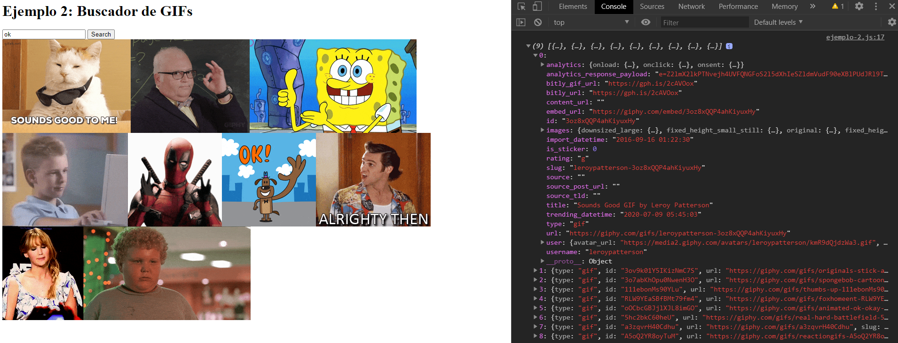

[`Programación con JavaScript`](../../Readme.md) > [`Sesión 12`](../Readme.md) > `Ejemplo 02`

---

## Ejemplo 2: Buscador de GIFs

### Objetivo

Utilizar la API de Giphy para buscar GIFs

#### Requisitos

Crear un archivo `index.html` con la siguiente estructura:

```html
<html>
  <head>
    <meta charset="utf-8"/>
    <title>Ejemplo 2: Buscador de GIFs</title>
  </head>
  <body>
  
  <h1>Ejemplo 2: Buscador de GIFs</h1>
  
  <div>
    <input type="text" id="search"/>
    <button id="button">Search</button>
  </div>
  
  <div id="results"></div>
  
  <script type="text/javascript" src="./ejemplo-2.js"></script>
  </body>
</html>
```

Dentro de la misma carpeta creamos un archivo `ejemplo-1.js` que es donde se trabajará este ejemplo. Finalmente abre el
archivo `index.html` en Chrome e inspecciona la consola para ver los resultados.

Es necesario registrarse en [Giphy](https://developers.giphy.com/) para obtener una API Key que se usará en cada request.

#### Desarrollo

Usaremos el [Search Endpoint](https://developers.giphy.com/docs/api/endpoint#search) para buscar GIFs en base a una
palabra o frase.

De acuerdo con la [documentación](https://developers.giphy.com/docs/resource#code-examples), la URL para realizar una
búsqueda con _Ryan Gosling_ se ve de la siguiente forma:

```javascript
const url = "http://api.giphy.com/v1/gifs/search?q=ryan+gosling&api_key=YOUR_API_KEY&limit=5"
```

Al igual que en el ejemplo anterior vamos a crear una función que nos retorne la url en el formato que lo necesitamos.
A esta función le vamos a pasar un string `search` que será el término de búsqueda. En la url vamos a limitar los
resultados a 9.

```javascript
function buildUrl (search) {
  const API_KEY = 'YOUR_API_KEY'; // Provided by GIPHY
  const baseUrl = 'http://api.giphy.com/v1/gifs/search';

  return `${baseUrl}?q=${search}&api_key=${API_KEY}&limit=9`;
}
```

Cuando buscamos más de dos palabras la API de Giphy espera que le enviemos las palabras separadas por `+` en lugar de
espacios. Vamos a crear otra función auxiliar para reemplazar los espacios en blanco.

```javascript
function formatSearchString(search) {
  return search.replace(/ /g, '+');
}
```

También vamos a separar la lógica que hace el request a la API en una función.

```javascript
function getGiphyResults(url) {
  return fetch(url)
    .then(function (response) {
      return response.json();
    })
    .then(function (data) {
      return data.data;
    })
    .catch(function(err) {
      console.log(err);
    })
}
```

Para unir todas las piezas vamos a agregar un event listener al botón, al momento de hacer click obtendremos el valor de
búsqueda del input, si el input no está vacío hacemos el request. Cuando obtengamos los resultados agregaremos las
imágenes de la misma manera que hicimos en el ejemplo anterior.

```javascript
const searchInput = document.getElementById('search');
const searchButton = document.getElementById('button');

const results = document.getElementById('results');

searchButton.addEventListener('click', searchGIFs);

function searchGIFs() {
  const search = searchInput.value;

  if(search) {
    const formattedSearch = formatSearchString(search);
    const url = buildUrl(formattedSearch);

    return getGiphyResults(url)
      .then(function(gifs) {
        console.log(gifs)
        gifs.forEach(function(gif) {
          const img = document.createElement('img');
          img.src = gif.images.fixed_height.url;
          img.alt = gif.title;

          results.appendChild(img)
        })
      })
  }
}

function formatSearchString(search) {
  return search.replace(/ /g, '+');
}

function buildUrl (search) {
  const API_KEY = 'YOUR_API_KEY'; // Provided by GIPHY
  const baseUrl = 'http://api.giphy.com/v1/gifs/search';

  return `${baseUrl}?q=${search}&api_key=${API_KEY}&limit=9`;
}

function getGiphyResults(url) {
  return fetch(url)
    .then(function (response) {
      return response.json();
    })
    .then(function (data) {
      return data.data
    })
    .catch(function(err) {
      console.log(err)
    })
}
```

Cada GIF cuenta con una propiedad `images`, la cual es una lista con distintas URLs para obtener las imágenes en
[diferentes medidas](https://developers.giphy.com/docs/api/schema/#image-object). En este ejemplo usamos `fixed_height`
para tener todas las imágenes con la misma altura.


