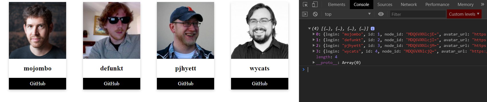

[`Programación con JavaScript`](../../Readme.md) > [`Sesión 12`](../Readme.md) > `Reto 01`

---

## Reto 1: Usuarios de GitHub

### Objetivos

Consumir la API de GitHub para obtener perfiles de usuarios

#### Requisitos

Crear un archivo `index.html` con la siguiente estructura:

```html
<html>
  <head>
    <meta charset="utf-8"/>
    <title>Reto 1: Usuarios de GitHub</title>
    <style>
        #app {
          display: flex;
        }
        .card {
          box-shadow: 0 4px 8px 0 rgba(0, 0, 0, 0.2);
          max-width: 200px;
          margin: auto;
          text-align: center;
        }
        .card img {
          max-width: 200px;
        }
        .button {
          display: inline-block;
          padding: 10px 0;
          color: #fff;
          background-color: #000;
          text-align: center;
          cursor: pointer;
          width: 100%;
          font-size: 18px;
          text-decoration: none;
        }
        .button:hover {
          opacity: 0.80;
        }
    </style>
  </head>
  <body>

    <div id="app"></div>

    <script type="text/javascript" src="./reto-1.js"></script>
  </body>
</html>
```

Dentro de la misma carpeta creamos un archivo `reto-1.js` que es donde se trabajará este reto.

#### Desarrollo

Con base en la documentación para usar la <a target="_blank" href="https://developer.github.com/v3/">API de GitHub</a>
obtener una lista de usuarios. De esa lista se tomarán 4 para mostrar la foto de perfil, el nombre de usuario y un botón
para ver el perfil en GitHub.

Toda esta información estará contenida en un `div` con la siguiente estructura:

```html
<div class="card">
  
  <h2>John Doe</h2>
  <a href="https://example.com/johndoe" target="blank" class="button">
    GitHub
  </a>
</div>
```


