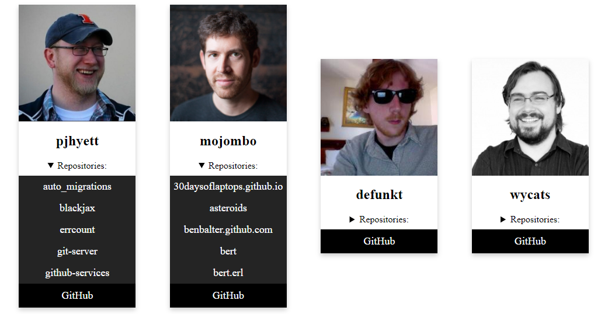

[`Programación con JavaScript`](../../Readme.md) > [`Sesión 12`](../Readme.md) > `Reto 02`

---

## Reto 2: Repositorios de GitHub

### Objetivos

Consumir la API de GitHub para obtener repositorios de usuarios

#### Requisitos

Continuar con el código creado en el [Reto 1](../Reto-01/Readme.md).

Agregar los siguientes estilos:

```css
details summary {
  margin-bottom: 8px;
}
.button-repo {
  display: inline-block;
  padding: 8px 0;
  color: #fff;
  background-color: #242424;
  text-align: center;
  cursor: pointer;
  width: 100%;
  font-size: 18px;
  text-decoration: none;
}
.button-repo:hover {
  opacity: 0.80;
}
```

#### Desarrollo

Por cada usuario agregar una lista con un máximo de 5 repositorios. Cada uno será un link para ver el repositorio en
Github.


